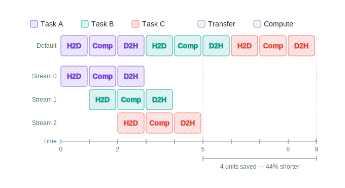

::: questions

- If NumPy arrays live in CPU memory, where do CuPy arrays live and what does that mean for your code?
- Why does benchmarking GPU code give misleadingly fast results if you aren't careful?
- How can you overlap independent computations and data transfers on the GPU?

:::

::: objectives

- Move data between host and device and perform NumPy-style computation on the GPU using CuPy.
- Benchmark GPU code correctly by accounting for asynchronous execution.
- Use CuPy features including broadcasting, linear algebra, FFTs, and operation fusion to accelerate array workloads.
- Run computations concurrently using CUDA streams.

:::

## CuPy as a drop-in replacement for Numpy

[Numpy's](https://numpy.org/) innovation has been to make high-performance [array programming](https://en.wikipedia.org/wiki/Array_programming) easily accessible from within Python. It has done this thanks to its multidimensional `ndarray` type which can be manipulated using scalar and elementwise operators, a range of mathematical functions, and very flexible broadcasting rules.

CuPy is the GPU equivalent to Numpy, and likewise it is based on its own `ndarray` type that lives on the GPU. If you are comfortable with numpy, CuPy should feel very familiar. Before attempting more advanced GPU programming techniques, CuPy should be your first port of call.

::: callout

Almost all of the Numpy functions that you are familiar with have a CuPy equivalent, and usually by the same name. [This comparison page](https://docs.cupy.dev/en/stable/reference/comparison.html) shows an exhaustive list of numpy (and scipy) functions and their CuPy equivalent, with only a handful of gaps where a CuPy equivalent is missing.

:::

## CPU arrays versus GPU arrays

Numpy's and CuPy's arrays are both multidimensional arrays, and they both expose similar APIs.

They differ in _where_ they reside. The CPU (host) and the GPU (device) each have their own independent memory, as we discussed in the GPU deep dive. Objects stored in host memory can't be "seen" by the GPU without first transferring the data across to the device, and vice versa.

Numpy arrays exist in host memory and CuPy arrays exist on the GPU. To perform operations involving multiple arrays you must ensure that each array is within the same portion of memory: if all the arrays are on the host, the computation will be performed by the CPU; if they are all on the device, the computation will be performed by the GPU.

It's up to you to handle transferring arrays back and forth between the host and device.

In `Numpy` we can create a numerical array from a range of iterables:

```python
import numpy as np

arr1 = np.array([1, 2, 3, 4, 5])  # from a list
arr2 = np.array(range(1, 1000, 2))  # from a range
arr3 = np.array([x**2 for x in range(1, 100)])  # from a list comprehension
```

These arrays all reside in host (CPU) memory.

To create a CuPy GPU array we can do something very similar and merely need to swap out `np` for `cupy`:

```python
import cupy
import numpy as np

arr1_d = cupy.array([1, 2, 3, 4, 5])  # from a list
arr2_d = cupy.array(range(1, 1000, 2))  # from a range
arr3_d = cupy.array([x**2 for x in range(1, 100)])  # from a list comprehension

# Or transfer across an existing numpy array:
arr4 = np.random.normal(size=1_000_000)
arr4_d = cupy.array(arr4)  # this is a copy!

# And to return back to the host:
arr3 = cupy.asnumpy(arr3_d)
```

Note the convention of appending `_d` to the names of arrays that are on the GPU **d**evice. This is purely convention but, in the absence of types, this can help you keep track of where an array is located.

(There's also `cupy.asarray(otherarray)`: this will return `otherarray` unchanged if it's already a CuPy GPU array, otherwise it will copy to the GPU. It's a handy function to ensure an array is on the GPU without an unnecessary copy if it's already there.)

::: callout

CuPy is often imported using `import cupy as cp` (compare with the usual `import numpy as np`), and so you might see this a lot in the documentation or in code you find online.

This only changes the name of the import. e.g. `cupy.array(...)` becomes `cp.array(...)`.

For clarity, we will use the full `cupy` name in this workshop.

:::

## An aside: on benchmarking

### Python's `timeit`

In Python, the easiest way to benchmark some code is to use the built-in module `timeit`.

For example:

```python
import timeit

import numpy as np

a = np.random.normal(size=100_000_000)
b = np.random.normal(size=100_000_000)

def my_computation(a, b):
    a += b

timer = timeit.Timer(lambda: my_computation(a, b))

# Call `my_computation()` just once, and repeat this 10 times
elapsed_times = timer.repeat(repeat=10, number=1)
print(min(elapsed_times))
```

The first argument to `Timer()` must be a callable that takes no arguments; we use a lambda function to capture and pass in the arguments. The method `repeat()` will return a set of times for each iteration. In most cases, you want to take the _minimum_ value from these repeats.

Now we can try running this same code on the GPU using CuPy:

```python
import timeit

import cupy

a = cupy.random.normal(size=100_000_000)
b = cupy.random.normal(size=100_000_000)

def my_computation(a, b):
    a += b

timer = timeit.Timer(lambda: my_computation(a, b))

# Call `my_computation()` just once, and repeat this 10 times
elapsed_times = timer.repeat(repeat=10, number=1)
print(min(elapsed_times))
```

Notice all we did to run this on the GPU was to swap the `np` namespace calls to `cupy`.

The time looks great. On my machine, the Numpy computation takes 0.44 ms whilst the CuPy takes 0.005 ms.

But there's a problem with this benchmarking. The CuPy code is being executed asynchronously: we are sending the computation to the GPU and then immediately continuing without waiting for the result. Since the CPU and the GPU are separate devices this is a great way to keep sending work across to the GPU, but it hides the true time of the computation.

One solution here is to force the code to behave synchronously. And we can do that by manually inserting a synchronisation call at the tail of our computation function:

```python
def my_computation(a, b):
    a += b

    # Wait here until the GPU is finished
    cupy.cuda.get_current_stream().synchronize()
```

Now if we measure the timings, the CuPy version on my machine takes 1.8 ms. That's still a great time but it's 3 orders of magnitude slower than we first reported!

### Using `cupyx.benchmark()`

Another way to avoid these issues is to use the benchmarking function provided by CuPy:

```python
import cupy
import cupyx

a = cupy.random.normal(size=100_000_000)
b = cupy.random.normal(size=100_000_000)

def my_computation(a, b):
    a += b

results = cupyx.profiler.benchmark(lambda: my_computation(a, b), n_repeat=10)
print(results)
```

This function inserts event timers onto the GPU device and is able to measure two different times: the CPU time and the GPU time. If you run this, you'll notice that the CPU time is much less than the GPU time, since the asynchronous computation returned control to the CPU almost immediately, whilst the GPU continued to execute in the background.

For me, benchmarking shows 0.008 ms recorded by the CPU, and 1.7 ms on the GPU — both very similar to what we measured earlier before and after we added the explicit synchronisation.

::: challenge

Modify the previous benchmark in the following way:

* Create the vectors `a` and `b` as numpy arrays first.
* Transfer these to GPU arrays _inside_ the `my_computation` function.

How does this affect the benchmark? Why?

:::

::: solution

```python
a = np.random.normal(size=100_000_000)
b = np.random.normal(size=100_000_000)

def my_computation(a, b):
    a_d = cupy.array(a)
    b_d = cupy.array(b)
    a_d += b_d

results = cupyx.profiler.benchmark(lambda: my_computation(a, b), n_repeat=10)
print(results)
```

The benchmark is significantly longer in this version due to the time taken for memory to be copied from host to device.

This is an important consideration to make in all your work with GPUs: even if the computation itself is faster, you must be careful that setup costs like memory transfers don't eclipse your savings.

:::


## Numpy-style computation

Addition, subtraction, trigonometric functions and so on: these all work just as they do with Numpy.

Let's consider computing the Taylor expansion of the exponential function. Recall that this is: $e^x = \sum_n \frac{x^n}{n!}$. In numpy we would compute this expansion as:

```python
def exp(xs, ys, degree=12):
    for n in range(degree):
        ys += xs**n / math.factorial(n)

xs = np.random.uniform(-1, 1, size=1_000_000)
ys = np.zeros_like(xs)
exp(xs, ys)
np.testing.assert_allclose(ys, np.exp(xs))
```

We can ensure these computations occur on the GPU simply by swapping in GPU arrays:

```python
def exp(xs, ys, degree=12):
    for n in range(degree):
        ys += xs**n / math.factorial(n)

xs = cupy.random.uniform(-1, 1, size=1_000_000)
ys = cupy.zeros_like(xs)
exp(xs, ys)
cupy.testing.assert_allclose(ys, cupy.exp(xs))
```

To have this compute on the GPU we did just two things:

* We ensured arrays were created (or transferred to) the GPU.
* We swapped out `np` module prefixes for `cupy`, e.g. by calling `cupy.exp()`.

The nitty gritty of _how_ CuPy compiles this to GPU code and the way in which it chooses to parallelise the code is out of our hands. In return, we get operations that are no more complicated than Numpy.

:::

## Broadcasting

Most complex computation will rely on Numpy's [broadcasting rules](https://numpy.org/doc/stable/user/basics.broadcasting.html). Broadcasting rules control how array dimensions are matched, with special rules that apply to dimensions having a length of 1. We are going to assume you are already familiar with these rules and work through a couple of examples that demonstrate the flexibility of CuPy.

### Example: Matrix multiplication

Consider the multiplication of two matrices: $A$ (sized $m \times n$) and $B$ (sized $n \times p$). Their product $C$ is a $m \times p$ matrix having elements $c_{ij} = \sum_{k=1}^n a_{ik} b_{kj}$.

We can write this by broadcasting multiplication over $A$ and $B$ so as to produce as $m \times n \times p$ 3-dimensional array, followed by a sum over the second dimension. (Pause and check this is true).

```python
def matmul(A, B):
    # Matrix multiplication using broadcasting
    return (A[:, :, None] * B[None, :, :]).sum(axis=1)
```

::: challenge

Benchmark the `matmul()` function on both the CPU and GPU using input matrices with dimensions 100 $\times$ 1000 and 1000 $\times$ 100. You will need to create input matrices that reside both on the host and the GPU and set up the benchmarking functions.

Bonus question: can you spot the danger of using this broadcasting algorithm for matrix multiplication? Hint: what happens if the matrices get larger?

:::

### Example: Discrete Fourier transform

The [discrete Fourier transform](https://en.wikipedia.org/wiki/Discrete_Fourier_transform) is defined as:

$X_k = \sum_n^N x_n  e^{-2 i \pi \frac{k n}{N}}$

We can write this as a broadcasting operation across 2 dimensions (k by n), followed by a sum along the second dimension:

```python
def DFT(xs):
    # This function returns either np or cupy module depending on array type
    # which lets us write device-agnostic code.
    xp = cupy.get_array_module(xs)

    N = len(xs)
    ks = xp.arange(0, N)
    ns = xp.arange(0, N)

    phases = ks[:, None] * ns[None, :] / N
    return xp.sum(
        xs[None, :] * xp.exp(-2j * np.pi * phases),
        axis=1
    )
```

This is a function with elementwise multiplication, complex exponentiation, scalar multiplication and summation. When our inputs are GPU arrays it happens entirely on the GPU.

::: callout

Did you spot the function `xp = cupy.get_array_module(arr)`? This is a very useful helper function to write device-agnostic code.

When passed a numpy array, this function will return the numpy module, and when passed a CuPy array it will return the CuPy module. This allows you to dispatch on the array type: instead of hardcoding calls to `np` or `cupy`, you can use `xp` to write functions that work seamlessly with both CPU or GPU arrays.

:::

::: challenge

Benchmark this code on both the CPU and GPU using a 1D input.

Create the input array by using normally distributed real and imaginary components: `xs = np.random.normal(size=N) + 1j * np.random.normal(size=N)`, and vary `N` between 100 and 5000.

:::

::: solution

In my own benchmarking, I see that the time taken for the DFT on the GPU stays fairly flat for $100 < N < 1000$ and only then starts to increase in time. This suggests that time taken on the GPU is initially dominated by the memory allocation and not the actual computation. The CPU, on the other hand, rapidly rises to take almost a second for $N = 5000$.

```python
import cupy
import cupyx
import numpy as np


def DFT(xs):
    # This function returns either np or cupy module depending on array type
    # which lets us write device-agnostic code.
    xp = cupy.get_array_module(xs)

    N = len(xs)
    ks = xp.arange(0, N)
    ns = xp.arange(0, N)

    phases = ks[:, None] * ns[None, :] / N
    return xp.sum(
        xs[None, :] * xp.exp(-2j * np.pi * phases),
        axis=1
    )


for N in[100, 200, 500, 1000, 2000, 5000]:
    print(f"N = {N}")
    for name, xp in [("Numpy", np), ("Cupy", cupy)]:
        xs = xp.random.normal(size=N) + 1j * xp.random.normal(size=N)
        print(f"  {name}:", cupyx.profiler.benchmark(lambda: DFT(xs), n_repeat=10))
```

### Fusing operations

Just like numpy, a series of array operations are applied to CuPy arrays sequentially. And this is true even if those operations all occur on the same line. This means that each operator (e.g. an addition, a scalar multiplication, perhaps a trigonometric function) is applied as a separate pass over the Numpy array, allocating intermediate arrays as though go, which means reading and writing through the entirety of the arrays each time. This memory churn can be a considerable performance penalty.

CuPy offers the (experimental) ability to _fuse_ multiple operations into a single pass by using the function decorator `@cupy.fuse`. In practice this means that multiple operators are applied as part of a single pass over the array and without using intermediate arrays.

```python
# This one line in Numpy is actually three separate operations:
# - A subtraction
# - A multiplication
# - and a cosine
# and each step creates intermediate arrays:
xs = np.cos(2 * (xs - 1))

# Numpy does all three operations separately.
# This is equivalent to three passes of the array `xs`, e.g.
tmp1 = np.empty_like(xs)
for i in range(len(xs)):
    tmp1[i] = xs[i] + 1

tmp2 = np.empty_like(xs)
for i in range(len(xs)):
    tmp2[i] = 2 * xs[i]

for i in range(len(xs)):
    xs[i] = np.cos(xs[i])

# But, if we could fuse the operations, this would be equivalent
# to a single pass of the array `xs` with no intermediate arrays
for i in range(len(xs)):
    xs[i] = np.cos(2 * (xs[i] + 1))
```

This functionality is experimental, and it comes with some limitations:

- Arrays must be fully allocated _outside_ the decorated function
- Array shapes must be fixed: reductions (like sum) or certain broadcasting operations that expand singleton axes will perform poorly

::: callout

Fusing is experimental and works best with combining simple, elementwise operations. It can take some experimentation to find which parts of your code work best with fusing. As always, benchark your code.

:::

::: challenge

Try running the following yourself and compare the performance between the regular and fused examples:

```
import cupy
import cupyx

def unfused(xs, ys):
    ys[:] = cupy.cos(2 * (xs - 1))

@cupy.fuse
def fused(xs, ys):
    ys[:] = cupy.cos(2 * (xs - 1))

xs = cupy.random.normal(size=100_000_000)
ys = cupy.empty(100_000_000)

print(cupyx.profiler.benchmark(lambda: unfused(xs, ys), n_repeat=100))
print(cupyx.profiler.benchmark(lambda: fused(xs, ys), n_repeat=100))
```

:::

## Linear Algebra

CUDA includes an extensive linear algebra library that is highly optimised, and CuPy's `linalg` routines provide an accessible interface to this library. If you can rewrite your problem succinctly as a series of linear algebra operations this will almost always be faster than a custom kernel.

Consider the example of a large matrix multiplication on both CPU and GPU:

```python
A = np.random.normal(size=(10_000, 10_000))
B = np.random.normal(size=(10_000, 10_000))

A_d = cupy.array(A)
B_d = cupy.array(B)

print(
    cupyx.profiler.benchmark(lambda: A @ B, n_repeat=10)
)

print(
    cupyx.profiler.benchmark(lambda: A_d @ B_d, n_repeat=10)
)
```

Note that here we've used the matrix multiplication operator, `@`, which is shorthand for either `np.linalg.matmul` or `cupy.linalg.matmul` depending on the array type.

The speed-up is huge: on my own hardware, I observe 16.6 s versus just 107 ms.

Similarly, we can perform matrix inversion or decomposition just as we would using numpy:

```python
# Let's solve for x in: Ax = y
A = cupy.random.normal(size=(1000, 1000))
y = cupy.random.normal(size=1000)

Ainv = cupy.linalg.inv(A)
x0 = Ainv @ y

# solve() uses a decomposition algorithm that is more
# numerically stable than the inverse matrix
x1 = cupy.linalg.solve(A, y)

# Check that both methods return that same solution
cupy.testing.assert_allclose(x0, x1)

# Perform QR decomposition
Q, R = cupy.linalg.qr(A)
```

There's also the `einsum()` method which is not a linear algebra method but which is very powerful if you can write your equations using [Einstein notation](https://en.wikipedia.org/wiki/Einstein_notation), e.g.:

```python
A = cupy.random.normal(size=(1000, 10_000))
B = cupy.random.normal(size=(10_000, 1000))

# Einstein notation for matrix multiplication
C = cupy.einsum("ij, jk -> ik", A, B)

cupy.testing.assert_allclose(C, A @ B)
```

::: challenge

Compute the [outer product](https://en.wikipedia.org/wiki/Outer_product) of two large vectors, `x` and `y`, using both CuPy built-in `cupy.outer` routine and using `einsum()`. Check that the different methods give the same result.

```python
x = cupy.random.normal(size=10_000)
y = cupy.random.normal(size=10_000)

# To do...
```

:::

::: solution

```python
x = cupy.random.normal(size=10_000)
y = cupy.random.normal(size=10_000)

A0 = cupy.outer(x, y)

A1 = cupy.einsum("i, j -> ij", x, y)

cupy.testing.assert_allclose(A0, A1)
```

:::

## FFT

The Fourier transform is a staple of signal processing, and the _fast_ Fourier transform (FFT) algorithm is already a massive improvement on the naive sum.

CUDA provides highly optimised libraries for performing FFTs and CuPy provides a high level wrapper that mirrors the numpy routines. In addition, it also exposes some lower-level routines that might be essential to getting good performance.

In numpy, for example, we can do the following FFT:

```python
# Create a complex valued 4 x 1024 x 1024 array where real
# and imaginary components are both normally distributed
a = np.random.normal(size=(4, 1024, 1024)) + 1j * np.random.normal(size=(4, 1024, 1024))

# Perform a 2D fft for each of the 4 1024 x 1024 matrices
A = np.fft.fftn(a, axes=(1, 2))
```

Performing this on the GPU involves the same steps as before: ensure the arrays reside in GPU memory and replace numpy with CuPy prefixed methods:

```python
# Create a complex valued 4 x 1024 x 1024 array where real
# and imaginary components are both normally distributed
a = cupy.random.normal(size=(4, 1024, 1024)) + 1j * cupy.random.normal(size=(4, 1024, 1024))

# Perform a 2D fft for each of the 4 1024 x 1024 matrices
A = cupy.fft.fftn(a, axes=(1, 2))
```

Try benchmarking the results: is it faster?

When you run a FFT the CUDA library actually does two things:

* It creates a plan: depending on your input data, the axes you care about, etc. it works out an optimal strategy to perform the FFT. This will almost always involve reserving some memory to use as a working space.
* It then executes a plan.

Plan creation creates an overhead. By default, newer versions of CuPy automatically cache these plans and will reuse the plan for identically configured FFTs. However, it is also possible to manually create and manage plans yourself which you might like to do to ensure plan reuse. For example:

```python
# Create a complex valued 4 x 1024 x 1024 array where real
# and imaginary components are both normally distributed
a = cupy.random.normal(size=(4, 1024, 1024)) + 1j * cupy.random.normal(size=(4, 1024, 1024))

# Create a plan
plan = cupyx.scipy.fft.get_fft_plan(a, axes=(1, 2))

# Plan acts as a context manager
with plan:
    A = cupy.fft.fftn(a, axes=(1, 2))
```

## Advanced topic: Streams and concurrency

We saw earlier in the *benchmarking* section that CuPy operations are **asynchronous**: when you call `a += b`, the work is dispatched to the GPU and Python immediately continues without waiting for the result. We can continue dispatching operations or we can wait for the operations to complete by calling `sychronize()` (and some operations will implicitly synchronize, like device to host transfers).

But don't be fooled by this aysnchronous operation: on the GPU, each of our operations proceed sequentially, one after the other. This ordering of operations on the GPU is managed by CUDA's concept of the **stream**. Think of it as a queue: operations submitted to the same stream are executed in the order they were submitted, and each will block pending operations until they are completed. In most cases, this is the right thing to do.

Up until now we've been (implicitly) using the default stream, which has meant our GPU operations have proceeded serially. But there are times when you might want to overlap or multiplex operations. For example, perhaps you want to perform a memory transfer _at the same time_ as you run a computation over data that has already been transferred. CUDA's answer to this is to use _multiple_ streams. Whilst each stream manages its queue sequentially, no such guarantee exists between streams. In fact, the different streams are free to execute concurrently, and the GPU can interleave work from multiple streams to maximize utilization.

Graphically, this interleaving of data transfer and computation can look something like this:



By default, every CuPy operation is submitted to the **default stream**. You can access the current stream as:

```python
current = cupy.cuda.get_current_stream()
print(current)  # <Non-blocking Stream id at 0x...>
```

The default stream serializes operations. If you want to overlap work, you can create your own streams:

```python
stream1 = cupy.cuda.Stream()
stream2 = cupy.cuda.Stream()
```

Use `Stream.use()` as a context manager to direct operations to a specific stream:

```python
# Operations in stream1
with stream1.use():
    a = cupy.random.normal(size=1_000_000)
    b = cupy.random.normal(size=1_000_000)
    result1 = a + b

# Operations in stream2 (may run concurrently with stream1)
with stream2.use():
    c = cupy.random.normal(size=1_000_000)
    d = cupy.random.normal(size=1_000_000)
    result2 = c + d

# Synchronize both streams to wait for completion
stream1.synchronize()
stream2.synchronize()
```

From Python's perspective, each step will appear to execute immediately until we reach the calls to `synchronize()`, which will block. In reality, what we've done is to queue up these operations into each of `stream1` and `stream2`, which (may) execute their operations concurrently.

Importantly: notice how we group together the data dependencies for each sequence _within_ the same stream. For example, notice that arrays `a` and `b` are created in the same stream where they are later used. (If we had data dependencies _between_ streams we would need to carefully and judiciously add calls to `synchronize()`.)

The key semantics are:

1. **Within a stream**: operations are guanteed to execute in submission order.
2. **Between streams**: operations *may* execute concurrently—the GPU schedules them based on available resources.
3. **Synchronization**: call `stream.synchronize()` to block the CPU until all operations in that stream have completed.

::: callout

A common idiom when using streams is to use them in combination with Python threads, where each Python thread has an associated default stream. If you're already comfortable with Python threading, this can often simplify managing state.

To do this we must start Python with the environment variable `CUPY_CUDA_PER_THREAD_DEFAULT_STREAM=1`. Then each Python thread will, by default, dispatch operations to its own stream. For example:

```python
from concurrent.futures import ThreadPoolExecutor

def compute(c):
    # Each thread implicity uses its own stream on the GPU
    a = cupy.random.normal(size=1_000_000)
    b = cupy.random.normal(size=1_000_000)
    return c * (a + b)

with ThreadPoolExecutor as executor:
    results = executor.map(compute, [1, 2, 3, 4, 5])
```

:::

::: challenge

Create three arrays on the GPU, then perform three independent computations (e.g., `a * 2`, `b ** 2`, `cupy.sin(c)`) each in their own respective stream. Synchronize all three streams and verify that the results are correct.

:::

::: solution

```python
s1 = cupy.cuda.Stream()
s2 = cupy.cuda.Stream()
s3 = cupy.cuda.Stream()

with s1.use():
    a = cupy.random.normal(size=1_000_000)
    r1 = a * 2

with s2.use():
    b = cupy.random.normal(size=1_000_000)
    r2 = b ** 2

with s3.use():
    c = cupy.random.normal(size=1_000_000)
    r3 = cupy.sin(c)

s1.synchronize()
s2.synchronize()
s3.synchronize()

# Verify
cupy.testing.assert_allclose(r1, a * 2)
cupy.testing.assert_allclose(r2, b ** 2)
cupy.testing.assert_allclose(r3, cupy.sin(c))
```
:::

## Advanced topic: Device selection

Many systems have multiple GPUs available, especially in supercomputing environments. To make full use of your allocation you need to be able to dispatch work across these GPUs.

Each GPU is fully independent: each has its own memory, its own streams, and its own computational availability. This degree of independence means that it is usually best to distribute work to GPUs that is similarly independent.

GPU selection can be done in varying levels of granularity:

1. **Selecting the GPU prior to running the program:** The environment variable `CUDA_VISIBLE_DEVICES` can be used at program startup to filter which devices can be seen by the program. For example, a program started as `CUDA_VISIBLE_DEVICES=2 python program.py` will only be able to see GPU device 2 and will default to using this device.
2. **Setting a default GPU from within the program:** CuPy will always set a default GPU which you can view as `cupy.cuda.Device()`. You can view the number of available GPUs by calling `cupy.cuda.runtime.getDeviceCount()`, and the default can be changed at any point by calling `cupy.setDevice(idx)`.
3. **Dispatching data and operations to different GPUs on an adhoc basis.**

For adhoc GPU device selection you can choose to either nominate the device for each call or use the device a context manager (similar to streams):

```python
# Option 1: Manually nominate the destination GPU
a_d2 = cupy.array([1, 2, 3], device=2)
b_d2 = cupy.array([4, 5, 6], device=2)

# Both arrays _must_ exist on the same device before performing a computation
result = a_d2 + b_d2

# Option 2: use a context manager
with cupy.cuda.Device(3):
    arr = cupy.array([1, 2, 3])
    print(arr.device)  # <CUDA Device 3>
```

::: challenge

Write code that discovers how many GPUs are available in the system, then creates a small array on each device and prints its device ID.

:::

::: solution

```python
import cupy

n_devices = cupy.cuda.runtime.getDeviceCount()

for i in range(n_devices):
    arr = cupy.array([1, 2, 3], device=i)
    print(f"Device {i}: {arr.device}")
```

:::
