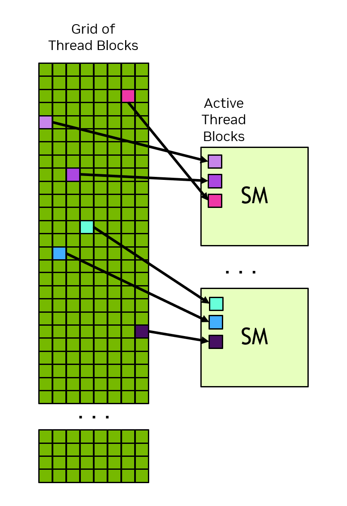
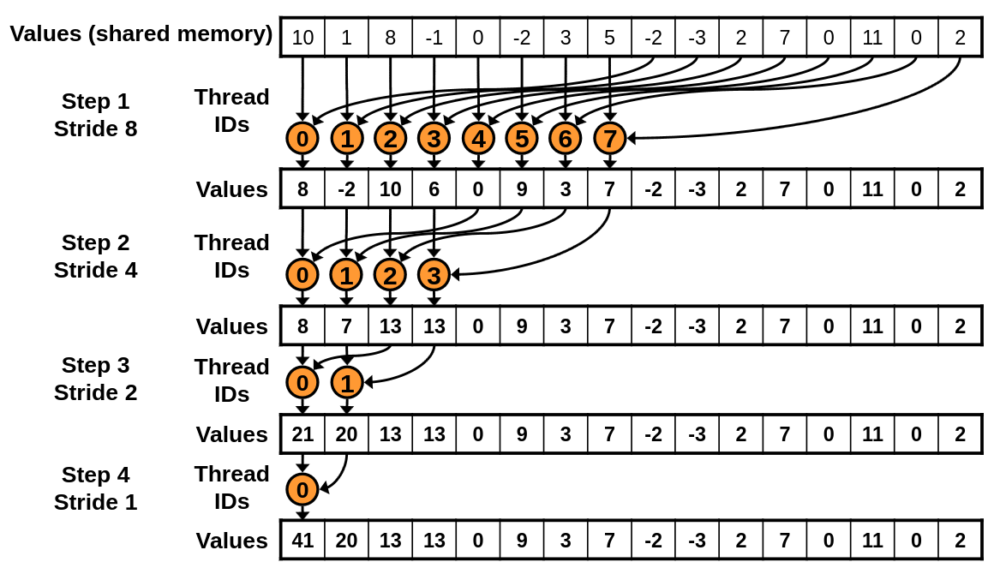

::: questions

- What is a GPU?

:::

::: objectives

- Understand a warp why multiples of 32 (or 64) threads is important
- Understand the hierarchy of GPU memory

:::

There are a few options for writing kernels in Python, however in this workshop we will prefer to use Numba. The reason for this is simple: Numba lets you write GPU kernels in (a limited subset of) Python. You will be able to draw on your existing knowledge of Python, and your existing tools, linters and syntax highlighting will all continue to work.

CuPy also makes it possible to write kernels, however the kernels are written in C and stored as text strings inside your python code; this means you must not only be proficient in C but you will also lose the syntax highlighting of your editor.

Whatever you choose, besides some syntactical differences, the concepts learned here translate one-to-one to kernels written directly in C or C++.

## What is a kernel?

Let's return to the example of adding two vectors elementwise. As a simple loop this looks like:

```python
import numpy as np

def adder(xs, ys):
    zs = np.empty_like(xs)
    for i in range(len(xs)):
        zs[i] = xs[i] + ys[i]

xs = np.random.normal(size=1000)
ys = np.random.normal(size=1000)
adder(xs, ys)
```

This is an ideal candidate for data parallelism, since each iteration of the loop is indepedent.

In a parallel context, the interior of the loop is referred to as a _kernel._ The kernel is a function that is called repeatedly and identically for each parallel iteration. A kernel depends on one key bit of information: the index `i`. This index tells the kernel "where" it is, and in this case which part of the input and output vectors are its concern.

For clarity, let's rewrite this as a parallel loop and with the kernel as a stand alone function:

```python
from numba import njit, prange
import numpy as np

@njit
def kernel(i, xs, ys, zs):
    zs[i] = xs[i] + ys[i]

@njit(parallel=True)
def adder(xs, ys, zs):
    for i in prange(len(xs)):
        kernel(i, xs, ys, zs)

N = 1000
xs = np.random.normal(size=N)
ys = np.random.normal(size=N)
zs = np.empty_like(xs)
adder(xs, ys)
```

In GPU programming, your work will be all about writing the kernel itself. The outer loop, on the other hand, is something that the GPU will manage for you. It is up to the GPU to decide how to parallelise that loop, when to run the kernels, and the order they execute in.

## A first kernel

Let's try writing this adder function as a kernel on the GPU.

```python
import math

import cupy
from numba import cuda

@cuda.jit
def adder_gpu(xs, ys, zs):
    i = cuda.grid(1)
    if i < len(xs):
        zs[i] = xs[i] + ys[i]

N = 1000
xs_d = cupy.random.normal(size=1000)
ys_d = cupy.random.normal(size=1000)
zs_d = cupy.empty_like(xs_d)

nthreads = 256
nblocks = math.ceil(N / nthreads)
adder_gpu[nblocks, nthreads](xs_d, ys_d, zs_d)
```

There's a lot to unpack in this brief snippet of code:

* First, we added a new import: `numba.cuda`.
* **We've wrapped our kernel with the decorator `@cuda.jit`.** Just like `numba.jit`, this will allow the kernel to compile "just in time" (jit) when we call it based on the input types (e.g. the types of `xs`, `ys`, and `zs`). There is an overhead associated with this initial compilation but subsequent calls will re-use the cached kernel so long as the input types remain unchanged.
* **We've called `cuda.grid(1)` to determine the index of the kernel.** Unlike our previous example, the index is not passed in as an argument. We've also added a condition to check the index is within range.
* **We've allocated our GPU kernels using `CuPy.array()`.** CuPy GPU arrays are compatible with `numba.cuda` kernels. Numba provides its own methods too, such as `cuda.device_array()`, `cuda.to_device()` and `array_d.copy_to_host()`, and you might want to use these instead if you don't want CuPy as a dependency in your project.
* **We've called the `add()` function by first providing grid dimensions: blocks and threads per block.** Grid dimensions configure _how many times_ the kernel is run and are directly related to the kernel's index. Each time you call a GPU kernel, you must configure its grid dimensions. We will discuss grid configuration in depth shortly.

::: challenge

Try benchmarking the each of the parallel CPU and GPU adder functions. Which is faster? Try making N larger: is there a point where their respective speeds swaps?

:::

::: solution

```python
import math

import cupy
import cupyx
import numpy as np
from numba import cuda, prange, njit

@njit
def kernel(i, xs, ys, zs):
    zs[i] = xs[i] + ys[i]

@njit(parallel=True)
def adder(xs, ys, zs):
    for i in prange(len(xs)):
        kernel(i, xs, ys, zs)

@cuda.jit
def adder_gpu(xs, ys, zs):
    i = cuda.grid(1)
    if i < len(xs):
        zs[i] = xs[i] + ys[i]

N = 12_000_000

xs = np.random.normal(size=N)
ys = np.random.normal(size=N)
zs = np.empty_like(xs)

xs_d = cupy.array(xs)
ys_d = cupy.array(ys)
zs_d = cupy.empty_like(xs_d)

result = cupyx.profiler.benchmark(lambda: adder(xs, ys, zs), n_repeat=100)
print(result)

nthreads = 256
nblocks = math.ceil(N / nthreads)
result = cupyx.profiler.benchmark(lambda: adder_gpu[nblocks, nthreads](xs_d, ys_d, zs_d), n_repeat=100)
print(result)
```

On my machine, the CPU remains faster for all workloads where N < 10,000,000 values. At around about 12,000,000 values, the CPU version begins to rapidly increase in duration and to be less performant than the GPU.

(Bonus question: why do you think the CPU version suddenly reaches a performance cliff?)

:::

## Grid dimensions

Recall that the GPU is responsible for managing the parallelisation of our kernels. It's up to us, however, to configure how that parallelisation occurs and in the CUDA model this occurs by setting the grid dimensions.

A grid is composed of one or more _thread blocks_, each with a fixed number of _threads_. The total number of threads in a grid is the number of thread blocks multiplied by the number of threads.

When a kernel is run, the work is distributed in the following manner:

1. The GPU scheduler parcels off thread blocks, and enqueues it to each streaming multiprocessor (SM) as it has some availability.
2. Each SM is then, in turn, responsible for scheduling the thread block to run as a series of warps (32 or 64 threads that run in lock step) as soon as it has idle cores.

Pictorially, this looks something like this:



You might wonder at this point: threads make sense as they're the fundamental unit of parallelisation, but why do I need to group them into blocks? And the answer is linked to the hardware design of the GPU. Inter-thread coordination, synchronisation and communication can only occur _within_ a SM, which in turn means only within a thread block. So far we've seen kernel examples that don't require these facilities, but many workloads (and optimisations) need inter-thread coordination or communication.

There's a few things to factor in when choosing a grid size:

- Ideally, choose the number of threads per block to be a multiple of your warp size. This means mulitples of 32 threads for NVIDIA hardware and 64 for AMD. Remember that theads are executed in lockstep as a warp; if its not a round multiple, any excess cores will nonetheless be enrolled in the warp with their result ignored.
- Don't make the threads per block too large. You want to strike a balance where you have a lot of blocks so that each SM has a queue of work that it can cycle through as its cores become idle; at the same time you want to ensure the blocks are large enough to mitigate overheads from block scheduling.
- Rarely will a grid size match the problem size. Whilst your threads per block must be a multiple of 32, we wouldn't expect your data to also also be an even multiple. When sizing your grid, you'll need to ensure your kernel includes a condition that checks that its index lies within the data.

A good rule of thumb for threads per block is somewhere between 128 to 1024 threads. As always benchmark your code.

You grid can 1, 2 or 3 dimensional. As an example, if we were adding two large matrices we might choose to index by row and column. In this case our code might look like:

```python
@cuda.jit
def add(xs, ys, zs):
    i, j = cuda.grid(2)  # The argument to grid determimines the dimension of the grid

    if i < xs.shape[0] and j < xs.shape[1]:
        zs[i, j] = xs[i, j] + ys[i, j]

xs = cupy.random.normal(size=(8192, 8192))
ys = cupy.random.normal(size=(8192, 8192))
zs = cupy.empty_like(xs)

add[(256, 256), (32, 32)](xs, ys, zs)
```

In practice, it is more common to a one dimensional index.

In actual fact, `cuda.grid()` and its sibling `cuda.gridsize()` (which returns the total number of threads across the grid) are helper functions. They wraps the more primitive variables:

- `cuda.threadIdx.x`: the thread index _within_ the thread block
- `cuda.blockDim.x`: the number of threads per block
- `cuda.blockIdx.x`: the block index within the grid
- `cuda.gridDim.x`: the number of blocks in the grid

(For multidimensional grids, the additional indices are available at `.y` and `.z`, e.g. `cuda.threadIdx.y`.)

Based on this, we can write our own versions of the helper functions:

- `cuda.grid(1)` is equivalent to `cuda.blockIdx.x * cuda.blockDim.x + cuda.threadIdx.x`
- `cuda.gridsize(1)` is equivalent to `cuda.blockDim.x * cuda.gridDim.x`

You should be comfortable with both versions as you'll see them used interchangably. Additionally, the extra information about where a thread lies within its block will prove useful in later kernels.

::: challenge

Return to `add_gpu` and modify the code so that it ensures the full arrays are added irrespective of the grid size. That is, ensure the each element is added whether the grid is sized too small or too large.

Hint: try replacing the `if` condition with a `for` loop having a step size given by `cuda.gridsize(1)`.

With the new configuration try modifying the thread and block count:

- What happens to the performance if you set the thread blocks to 1 and threads per block to 256? Why?
- What happens if you set `nthreads` very large, perhaps to 4096?

:::

::: solution

Your kernel should look something like this:

```python
@cuda.jit
def adder_gpu(xs, ys, zs):
    for i in range(cuda.grid(1), len(xs), cuda.gridsize(1)):
        zs[i] = xs[i] + ys[i]
```

:::

Using a for loop like this is a very common idiom in kernel design. As before, it ensures we stay within the bounds of the array, but it doesn't rely on the grid being properly sized. Later, you'll see it lends itself to other common optimisations.

When the block size it set to 1, the GPU is able to utilise only one of its SMs. The rest will sit idle, resulting in very poor utilisation of the GPU, also known as _occupancy_.

When the thread size is too large, your kernel may crash. When especially large, the kernel may exceed the shared resources of the SM, for example its register space. It's rare that thread counts greater than 1024 are useful or performant.

::: challenge

Rewrite the adder kernel using the underlying thread and block indices directly, instead of `grid()` and `gridsize`.

:::

::: solution

```python
@cuda.jit
def adder_gpu(xs, ys, zs):
    i0 = cuda.blockDim.x * cuda.blockIdx.x + cuda.threadIdx.x
    step = cuda.blockDim.x * cuda.gridDim.x

    for i in range(i0, len(xs), step):
        zs[i] = xs[i] + ys[i]
```

:::

## An aside: warp divergence

We've talked earlier about how a warp executes its threads in lockstep. But in the previous examples we included the condition `cuda.grid(1) < len(xs)`. How can a SIMT execution model handle a condition?

When a warp encounters a condition, it will first evaluate the condition. Then:

- If the condition evaluates _identically_ across the warp (e.g. each thread evaluates to true), then the warp will continue executing the one conditional branch.
- On the other hand, if threads evaluate _differently_ across the warp then we get _warp divergence_. In this case, the warp must evaluate both branches of the condition, and due to the lockstep nature of SIMT, it will do this sequentially: first one branch, and then the other. Each thread that is not part of the current conditional branch will be masked, essentially performing a "no-op" for eachof their respective processor cycles.

Warp divergence is expensive since it wastes processor cycles. You will want to ensure warp divergence occurs in as few warps as possible, and this plays a factor in both kernel design and grid configuration.

In the previous `adder` kernel, you will notice warp divergence occurs in exactly one warp: the warp whose index range breaches the length of the underlying arrays.

## Mutliplier

::: exercise

With just minor modifications, change the 1D `adder` kernel to a `mutliplier` kernel that computes elementwise multiplication. e.g. $z_i = x_i \times y_i$.

Add a test to ensure correctness.

```python
import math

import cupy
from numba import cuda

@cuda.jit
def multiplier(xs, ys, zs):
    # TODO

N = 12_000_000
xs_d = cupy.random.normal(size=N)
ys_d = cupy.random.normal(size=N)
zs_d = cupy.empty_like(xs_d)

# TODO:
# 1. Configure the thread and block count
# 2. Call the kernel
# 3. Test output using cupy.testing.assert_allclose()
```

:::

::: solution

```python
import math

import cupy
from numba import cuda

@cuda.jit
def multiplier(xs, ys, zs):
    i = cuda.grid(1)
    zs[i] = xs[i] * ys[i]

N = 12_000_000
xs_d = cupy.random.normal(size=N)
ys_d = cupy.random.normal(size=N)
zs_d = cupy.empty_like(xs_d)

nthreads = 256
nblocks = math.ceil(N / nthreads)
multiplier[nblocks, nthreads](xs_d, ys_d, zs_d)

cupy.testing.assert_allclose(zs_d, xs_d * ys_d)
```

:::

## Matrix multiplication

Let's attempt to write our own kernel that performs matrix multiplication. Recall that if $A$ is an $m \times n$ matrix, and $B$ a $n \times p$ matrix, then their product is a $m \times p$ matrix $C$ having elements $c_{ij} = \sum_{k=1}^n a_{ik} b_{kj}$.

Let's begin by first writing this in simple Python as a series of for loops:

```python
import numpy as np

def matmul(A, B, C):
    for i in range(C.shape[0]):
        for j in range(C.shape[1]):
            for k in range(A.shape[1]):
                C[i, j] += A[i, k] * B[k, j]

A = np.random.normal(size=(32, 16))
B = np.random.normal(size=(16, 24))
C = np.zeros((32, 24))
matmul(A, B, C)

np.testing.assert_allclose(C, A @ B)

```

When considering how to design a kernel for this problem, we need to answer a few interrelated questions:

- What is a unit of parallelisation? Or put differently, what does the index of each kernel map to in our problem domain? Is it an element in one (or both) of the input matrices? Is it an element of the output matrix? Is it a row or column?
- How should we configure our grid? What is the span of the grid and what is its dimension?

::: exercise

Consider the following three different variants of kernels and associated grid configurations. What is the preferred choice and why?

**Option 1:**

```python
# Grid: 3D grid over all values of i, j, k
def kernel1(i, j, k, A, B , C):
    C[i, j] += A[i, k] * B[k, j]

# Grid: 2D grid over all values of i, j
def kernel2(i, j, A, B, C):
    for k in range(A.shape[1]):
        C[i, j] += A[i, k] * B[k, j]

# Grid: 2D grid over all value sof i, k
def kernel3(i, k, A, B, C):
    for j in range(C.shape[1]):
        C[i, j] += A[i, k] * B[k, j]

# Grid: 1D grid over all values of i
def kernel3(i, A, B, C):
    for j in range(C.shape[1]):
        for k in range(A.shape[1]):
            C[i, j] += A[i, k] * B[k, j]
```

:::

::: solution

Two considerations stand out when comparing the kernel options:

* **Race conditions:** Recall that reading, computing, and writing to memory in parallel code does not happen all at once, and multiple threads competing to do this to _the same memory location_ will introduce _race conditions_. Kernels 1 and 3 both introduce kernels with race conditions. In kenrel 1, for each `i,j` coorindate there will be `k` competing kernels. The situation is similar for kernel 3. There are (complex) ways to mitigate these race conditions but we would have to be justified in taking this route.
* **Maximal parallisation:** All things being equal, we would typically want to maximise the degree of parallelisation and fan out the work across the many thousands of cores of the GPU. Kernel 1 has $i \times j \times k$ threads which, if it didn't suffer from race conditions, would be ideal. In constrast, kernel 3 parallelises only over the $i$ rows of $A$ and for most sizes of matrices even with thousands of rows, this will poorly utilise the GPU (also known as poor occupancy). Kernel 2, on the other hand, has $i \times j$ threads, which even for kernels with dimensions of only a few hundred rows and columns results in tens of thousands of threads.

On these grounds, kernel 2 is the preferred option with a 2D grid configuration than spans $i \times j$.

:::

::: challenge

Have a go at filling in the missing lines from within the kernel definition and grid configuration.

```python
import cupy
from numba import cuda

@cuda.jit
def matmul(A, B, C):
    i, j = cuda.grid(2)
    if i < C.shape[0] and j < C.shape[1]:
        # TODO

A = cupy.random.normal(size=(100, 200))
B = cupy.random.normal(size=(200, 150))
C = cupy.zeros((100, 150))

threads = 16
nblockx = math.ceil( #TODO )
nblocky = math.ceil( #TODO )
matmul[(nblockx, nblocky), (threads, threads)](A, B, C)

cupy.testing.assert_allclose(C, A @ B)
```

:::

::: solution

One solution looks like this:

```python
@cuda.jit
def matmul(A, B, C):
    i, j = cuda.grid(2)
    if i < C.shape[0] and j < C.shape[1]:
        for k in range(A.shape[1]):
            C[i, j] += A[i, k] * B[k, j]
```

An alternative is to store the partial sum in a _local_ variable before writing out to the global memory location at `C[i, j]`. For example:

```python
@cuda.jit
def matmul(A, B, C):
    i, j = cuda.grid(2)
    if i < C.shape[0] and j < C.shape[1]:
        cij = 0
        for k in range(A.shape[1]):
            cij += A[i, k] * B[k, j]

        C[i, j] = cij
```

Try benchmarking these two versions. Which is faster? Can you guess why?

:::

::: challenge

Rewrite the matrix multiplication using a 1D grid. Under this configuration, every kernel is still responsible for a single element of $C$ but it must map from a 1D index to a 2D index. What is the span of the 1D grid? Hint: familiarise yourself with the Python function `divmod()`.

:::

::: solution

```python
import math

import cupy
from numba import cuda

@cuda.jit
def matmul(A, B, C):
    ij = cuda.grid(1)

    if ij < C.size:
        i, j = divmod(ij, C.shape[1])

        for k in range(A.shape[1]):
            C[i, j] += A[i, k] * B[k, j]


A = cupy.random.normal(size=(100, 200))
B = cupy.random.normal(size=(200, 150))
C = cupy.zeros((100, 150))

threads = 256
nblocks = math.ceil(C.size / threads)
matmul[nblocks, threads](A, B, C)

cupy.testing.assert_allclose(C, A @ B)
```

:::

## Discrete Fourier transform

We've previously used broadcasting to perform a discrete Fourier transform (DFT). In this section we will guide you through writing your own from scratch.

For simplicity, we'll consider just a one-dimensional transform which is defined as:

$X_k = \sum_n^N x_n  e^{-2 i \pi \frac{k n}{N}}$

In all the examples, we'll using a complex input given by:

```python
xs = np.random.normal(N) + 1j * np.random.normal(N)
```

for varying values of N.


::: challenge

### Part 1

Write the DFT using a simple python `for` loop. At this stage, set `N` to be small (~100).

Check your routine by comparing the answer to numpy's own FFT.

:::

::: solution

```python
def dft(xs):
    Xs = np.zeros_like(xs)

    N = len(xs)
    for k in range(N):
        for n in range(N):
            Xs[k] += xs[n] * np.exp(-2j * np.pi * k * n / N)

    return Xs
```

:::

::: challenge

### Part 2

Parallelise your code using numba's `prange` function. Which loop or loops are parallel? What is the unit of parallelisation?

Extract the inner loop as a standalone kernel function.

:::

::: solution

```python
@njit
def kernel(k, xs, Xs):
    N = len(xs)
    for n in range(N):
        Xs[k] += xs[n] * np.exp(-2j * np.pi * k * n / N)

@njit(parallel=True)
def dft(xs):
    Xs = np.zeros_like(xs)

    for k in prange(N):
        kernel(k, xs, Xs)

    return Xs
```

:::

::: challenge
### Part 3

Complete the transition to a working GPU kernel:

- Modify your kernel into a GPU kernel by using the decorator `cuda.jit` and by retrieving the index using `cuda.grid(1)`. (Don't forget to add a condition that checks bounds!)
- Minimise writes to global memory in your kernel by using a local accumulator variable.
- Configure a 1D grid using 256 threads and calculate the number of required blocks.
- Ensure the input and output arrays reside on the GPU.

By the end, you should have a working GPU kernel. Check that the kernel works correctly by comparing to `cupy.fft.fft()`.

**Hint:** `np.exp()` is not available on the GPU. The function `math.exp()` is available however it will only accept real values. The trick is to recall that $e^{i \theta} = \cos{\theta} + i \sin{\theta}$ and to use this identity to rewrite the computation. That is: `np.exp(1j * phase) = complex(math.cos(phase), math.sin(phase))`.

:::

::: solution

```python
import math

import cupy
from numba import cuda
import numpy as np

@cuda.jit
def dft(xs, Xs):
    k = cuda.grid(1)
    N = len(xs)

    if k < N:
        xs_k = complex(0)
        for n in range(N):
            phase = -2 * np.pi * k * n / N
            xs_k += xs[n] * complex(math.cos(phase), math.sin(phase))

        Xs[k] = xs_k

N = 100_000
xs = cupy.random.normal(size=N) + 1j * cupy.random.normal(size=N)
Xs = cupy.zeros_like(xs)

threads = 256
nblocks = math.ceil(N / threads)

dft[nblocks, threads](xs, Xs)

cupy.testing.assert_allclose(Xs, cupy.fft.fft(xs))
```

:::

## Advanced topic: Parallel reductions

A [reduction](https://en.wikipedia.org/wiki/Reduction_operator) is an operation that combines multiple elements down to one. Think, for example, summing an array where the reduction operator is addition (`+`). Often times the input array will be modified first (known as a map) and then reduced, with the combined operation known as a [mapreduce](https://en.wikipedia.org/wiki/MapReduce).

In parallel contexts, reductions are not easy to write. Consider the following implementation of a sum:

```python
@cuda.jit
def sum(xs, acc):
    # Each thread performs a partial sum
    _acc = 0
    for i in range(cuda.grid(1), len(xs), cuda.gridsize(1)):
        _acc += xs[i]

    acc[0] += _acc

N = 100_000_000
xs = cupy.random.normal(size=N)
acc = cupy.zeros(1)

threads = 256
nblocks = math.ceil(N / threads / 4)  # each thread will add 4 elements of xs
sum[nblocks, threads](xs, acc)
```

In general, this will fail. Can you see why?

As we saw in the parallelism section, this fails due to a race condition: each thread is attempting to read, add, and write a value to global memory, walking all over each other.

One tool in our toolbox is [_atomic operations_](https://nvidia.github.io/numba-cuda/user/intrinsics.html#supported-atomic-operations). These are a limited set of operations (e.g. +, `max`, `min`, but not multiplication!) on a limited set of types (mostly just floats and integers) that allow us to do something like a read-add-write _as a single operation._ In this case, we can use `cuda.atomic_add()` and see how this works:

```python
@cuda.jit
def sum(xs, acc):
    # Each thread performs a partial sum
    _acc = 0
    for i in range(cuda.grid(1), len(xs), cuda.gridsize(1)):
        _acc += xs[i]

    cuda.atomic.add(acc, 0, _acc)
```

The tests pass, meaning that this is at least correct. But if we benchmark you'll see that it is very slow. And the simple reason is that atomic operations don't come for free. It still ultimately forces some kind of serialisation of the operations.

The idiomatic solution to a reduction is twofold: perform a reduction _within_ a thread block, followed by a reduction across the full grid.

To do this, we're going to introduce shared memory: shared memory is memory that is visible by each member of a thread block. The general idea is this:

- Each thread will perform a local, partial sum.
- We will construct a shared memory array that has a size that exactly matches the threads per block.
- Each thread in a threadblock will set its associated entry in the shared array to its partial sum.
- The threadblock will sum the contents of its shared memory using a binary reduction (see diagram).
- Finally, thread ID=0 of the thread block will perform an atomic add to global memory.



**Caption:** An illustration of a binary reduction within thread block. On each step, only half the number of threads participate in the reduction as in the previous step. [[Source]](https://developer.download.nvidia.com/assets/cuda/files/reduction.pdf)

One such implementation looks like this:

```python
@cuda.jit
def sum(xs, acc):
    # Allocate a shared array sized to match the threads per block
    shared = cuda.shared.array(256, dtype=np.float64)

    # Each thread performs a partial sum
    _acc = float(0)
    for i in range(cuda.grid(1), len(xs), cuda.gridsize(1)):
        _acc += xs[i]

    # Every thread loads its partial sum into its associated shared memory address
    tid = cuda.threadIdx.x  # thread ID - not grid ID!
    shared[tid] = _acc
    cuda.syncthreads()

    # Reduction of the shared memory across the thread block
    for offset in (128, 64, 32, 16, 8, 4, 2):
        if tid < offset:
            shared[tid] += shared[tid + offset]
            cuda.syncthreads()

    # Thread ID=0 adds the entire threadblock sum to global memory
    if tid == 0:
        cuda.atomic.add(acc, 0, shared[0] + shared[1])
```

Notice the use of `cuda.syncthreads()`: this is a synchronisation method that ensures all threads in a thread block have reached this point. (Remember that only warps execute in lock step.) This is necessary once we start interacting with shared memory, since we need to guarantee that the entirety of the thread block has fully written to its shared memory address before any thread tries to make a read.

Benchmarking shows this function is now quite fast. The cost of the atomic add is now mitigated by the fact that it is called only once for every thread block. For large arrays, this function is almost as fast as the highly optimised `cupy.sum()`.

For more information about advanced reduction optimisations, I recommend these [NVIDIA slides](https://developer.download.nvidia.com/assets/cuda/files/reduction.pdf).
