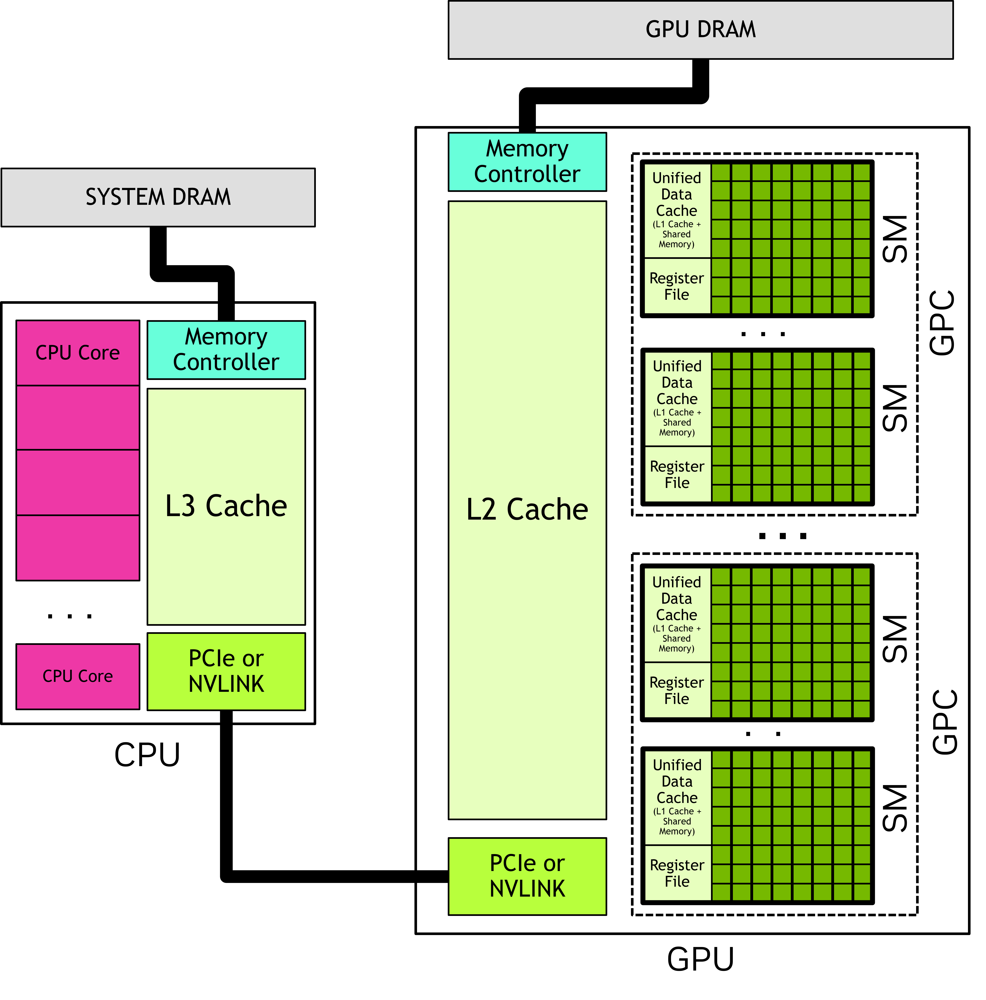

::: questions

- How does a GPU SM (Streaming Multiprocessor) differ from a CPU core?
- What is a "Warp" and why is it the fundamental unit of execution?

:::

::: objectives

- Explain Latency Hiding and why it requires high occupancy.
- Describe the GPU memory hierarchy (Registers → Shared → Global).
- Explain why thread counts should be multiples of 32.

:::

## A little history

Graphics Processing Units (GPUs) were originally built to offload 2D and 3D visualisation computation from the CPU onto a dedicated device. The nature of video processing workloads meant that GPUs were built to handle data parallel workloads from the start. As GPUs became increasingly sophisticated, especially with the advent of programmable shaders and floating point support, it became apparent that GPUs offered the potential to perform _general purpose_ computation (GPGPU). By early as 2003 there were already papers demonstrating how GPU graphics primitives could be repurposed to perform linear algebra.

NVIDIA formalised this general purpose computing on its GPUs with its release of the CUDA library in 2006. Much later in 2016, AMD released ROCm which provided a similar GPGPU interface to its own hardware. There are also open source APIs including OpenCL and Sycl, Microsoft's OneAPI which claims to bridge a range of accelerators, as well as AMD's cross-platform compatibility layer known as HIP. Despite these offerings, there remains strong vendor lock-in, and NVIDIA and its proprietary CUDA API remains dominant.

Today, GPUs have diverged somewhat in their design depending on whether they are destined to function as a true _graphics_ processing device or as more general purpose compute _accelerator_. Increasingly, AI workloads are driving design decisions that might not be useful for (or even harm!) some scientific workloads.

## The GPU

In most systems, the GPU is physically distinct from the CPU. It has its own computing cores, its own memory, its own floating point units, its own controllers, and a number of other units. The CPU and the GPU communicate with each other across some kind of serialisation link such as PCIe.

Oftentimes you will see the CPU referred to as the host, and the GPU referred to as the device. This language should stress the separation of these two domains.

In the simplest terms, a GPU is two things:

* Parallel compute, provided by numerous streaming multiprocessors (SM), each of which in turn hosts numerous cores (and other resources)
* Memory, at a range of tiers that includes DRAM ("global"), SRAM ("shared"), registers and numerous caches

### Streaming multiprocessor

**A streaming multiprocessor (SM) is a collection of cores that are grouped together and share some resources in common.** Take for example the recent NVIDIA B200 GPU: this has 148 SM, and each SM has 128 cores.

GPU cores (sometimes called a 'CUDA cores', or 'shader processors') are like the cores on your CPU but differ in some important ways:

- They are individually slower. The B200, for example, has clock speeds of only 700 MHz. In highly parallelisable computations, thousands of slow cores tend to be faster than a handful of very fast cores.
- They are much simpler in design.
- They are physically smaller, mostly as a result of being slower and simpler.
- They don't have their own register space. Registers are the small "scratch pad" of memory that is immediately accessible by a core. On a CPU, the register is attached to the core, with the downside that if a thread moves between cores it must also move the register memory. On a GPU, the register space is shared by the SM, which makes it easy to suspend and resume threads with little overhead.
- They always run in SIMD/SIMT mode. Threads are grouped together into a batches of 32 (or 64 on AMD hardware) known as a _warp_ and assigned to run in lockstep.

A SM has a number of resources shared amongst the cores. We've already seen that the register space is shared. In addition, it has a shared floating point unit (FPU) where, just like on the CPU, when floating point math needs to be performed, the work will be delegated to this shared unit. Unlike on CPUs, these FPUs also have specialised hardware for computing some more complex math functions, like exponents, logarithms and trigonometry. More modern GPUs also have tensor cores which are specialised for matrix operations.

You might ask, why have the streaming multiprocessor at all? Why have this intermediary entity in the hierarchy between the GPU and the cores themselves? The answer: physical locality. A GPU is a physical device and distance matters. By grouping the cores and assigning each a set of shared resources that reside nearby on the die, we can make their use cheaper and faster.

### Understanding memory

The GPU has its own memory that is distinct from the host memory. In fact, the GPU can't "see" host memory (and vice versa) and memory must be transferred back and forth between host and device depending on where it is needed.

The GPU has multiple layers of memory, each with different trade offs:

| Memory type | Operation |  Visibility | Size | Speed |
|---|---|---|----|---|
| **Global** | Manual | All threads | Tens of GBs | Slow |
| **Shared** | Manual | Thread block | Hundreds of KBs | Fast |
| **Registers** | Manual | Thread | Hundreds of KBs | Fastest |
| **L1 Cache** | Automatic | SM | Hundreds of KBs | Fast |
| **L2 Cache** | Automatic | All threads | Tens of MBs | Moderate |

**Global memory** is where all input data must start and ultimately where the results of any computation must be written. When we transfer memory from host to device, or back again, we are using global memory. It is the largest store of memory on the GPU and is visible by all threads on the GPU. It is fully controlled by the host: the host allocates the memory and chooses when to destroy it. It thus outlives any kernels that run in the interim.

**Shared memory** is a much smaller pool of transient memory that can be utilised by a thread block, and which lives only as long as the thread block. Shared memory resides within the SM itself and is much faster than global memory. Shared memory is often used by thread blocks as a shared cache or as a means to communicate and coordinate work.

**Registers** are the collection of individual variables used by a single thread. For example, a register might be used by a loop counter, or to store an intermediate calculation, or to cache a value from global memory so that it can later be used. Registers exist only for the life of the thread and are visible only to itself. Unlike with CPUs, registers aren't attached directly to processing cores, but are shared by the entire SM: this allows a warp to be paused and later continued on any of the SMs cores without worrying about transferring registers.

(Register spills occur when a thread uses so many registers that they can't all fit in the SM. When this happens, the compiler (silently) lets some of the registers "spill" into global memory. These values are referred to as local memory: they're accessible only by the thread even though they are physically stored in global memory. Needless to say, you will want to avoid register spills as they are terrible for performance.)

The remaining memory types are caches that are automatically populated and managed by the device. They may make commonly accessed parts of global memory faster, depending on the caching policy in effect.

**Understanding the different types of GPU memory is crucial to GPU optimisation work**. In general, we want to write code that minimises slow global memory operations as much as possible, swapping these for much faster shared or register memory operations.

<svg viewBox="0 0 1000 500" style="width: 100%; max-height: 500px; background: #fff"><text x="500" y="30" text-anchor="middle" fill="#010101" font-size="18" font-weight="700">CUDA Memory Hierarchy (Blackwell B200)</text><rect x="100" y="60" width="800" height="70" rx="12" fill="rgba(239, 68, 68, 0.15)" stroke="#ef4444" stroke-width="2"></rect><text x="500" y="95" text-anchor="middle" fill="#010101" font-size="16" font-weight="600">Global Memory (HBM3e) — 192 GB</text><text x="500" y="118" text-anchor="middle" fill="rgba(0,0,0,0.5)" font-size="12">8.0 TB/s bandwidth • ~400 cycle latency • Off-chip DRAM</text><path d="M500,135 L500,165" stroke="rgba(0,0,0,0.3)" stroke-width="2" marker-end="url(#arrow)"></path><text x="520" y="155" fill="rgba(0,0,0,0.4)" font-size="10">PCIe/NVLink</text><rect x="150" y="175" width="700" height="65" rx="10" fill="rgba(59, 130, 246, 0.15)" stroke="#3b82f6" stroke-width="2"></rect><text x="500" y="207" text-anchor="middle" fill="#010101" font-size="15" font-weight="600">L2 Cache — 96 MB (Unified across all SMs)</text><text x="500" y="228" text-anchor="middle" fill="rgba(0,0,0,0.5)" font-size="11">~12 TB/s bandwidth • ~100 cycle latency • Hardware managed</text><path d="M350,245 L350,275" stroke="rgba(0,0,0,0.3)" stroke-width="2"></path><path d="M500,245 L500,275" stroke="rgba(0,0,0,0.3)" stroke-width="2"></path><path d="M650,245 L650,275" stroke="rgba(0,0,0,0.3)" stroke-width="2"></path><rect x="120" y="280" width="760" height="200" rx="12" fill="rgba(0,0,0,0.02)" stroke="rgba(0,0,0,0.1)" stroke-width="1" stroke-dasharray="4"></rect><text x="140" y="300" fill="rgba(0,0,0)" font-size="11">Per-SM Memory</text><rect x="150" y="310" width="320" height="55" rx="8" fill="rgba(6, 182, 212, 0.15)" stroke="#06b6d4" stroke-width="1.5"></rect><text x="310" y="338" text-anchor="middle" fill="#010101" font-size="13" font-weight="600">L1 Data Cache — 256 KB/SM</text><text x="310" y="355" text-anchor="middle" fill="rgba(0,0,0,0.5)" font-size="10">Hardware managed • Combined with shared</text><rect x="530" y="310" width="320" height="55" rx="8" fill="rgba(34, 197, 94, 0.15)" stroke="#22c55e" stroke-width="1.5"></rect><text x="690" y="338" text-anchor="middle" fill="#010101" font-size="13" font-weight="600">Shared Memory — 228 KB/SM</text><text x="690" y="355" text-anchor="middle" fill="rgba(0,0,0,0.5)" font-size="10">User managed • 32 banks • ~20 cycles</text><path d="M310,370 L310,395" stroke="rgba(0,0,0,0.3)" stroke-width="2"></path><path d="M690,370 L690,395" stroke="rgba(0,0,0,0.3)" stroke-width="2"></path><rect x="200" y="400" width="600" height="50" rx="8" fill="rgba(245, 158, 11, 0.15)" stroke="#f59e0b" stroke-width="1.5"></rect><text x="500" y="425" text-anchor="middle" fill="#010101" font-size="14" font-weight="600">Registers — 256 KB/SM (65,536 × 32-bit per SM)</text><text x="500" y="442" text-anchor="middle" fill="rgba(0,0,0,0.5)" font-size="10">Fastest storage • 1 cycle latency • Per-thread private</text><rect x="100" y="465" width="180" height="30" rx="6" fill="rgba(168, 85, 247, 0.1)" stroke="#a855f7" stroke-width="1"></rect><text x="190" y="485" text-anchor="middle" fill="#a855f7" font-size="11">Constant Cache (64KB)</text><rect x="720" y="465" width="180" height="30" rx="6" fill="rgba(236, 72, 153, 0.1)" stroke="#ec4899" stroke-width="1"></rect><text x="810" y="485" text-anchor="middle" fill="#ec4899" font-size="11">Texture Cache</text><defs><marker id="arrow" markerWidth="10" markerHeight="10" refX="9" refY="3" orient="auto"><path d="M0,0 L0,6 L9,3 z" fill="rgba(0,0,0,0.3)"></path></marker></defs></svg>

(Image: [Subramaniyam Pooni](https://sampooni.github.io/ai-accelerator-report-2026/nvidia/04-nvidia-memory-optimization.html))

### The grid

When launching a computation on the GPU, you must first configure its _grid_. A grid consists of:

* A configurable number of _threads_. Threads are the fundamental unit of parallelisation and are usually numbered in the millions.
* Threads are grouped together into _thread blocks_, each thread block having a fixed number of threads.
* Finally, the collection of thread blocks forms the grid.

You might wonder, why do we have thread blocks? The reason: thread blocks are executed on a single SM, and this gives their threads special powers. In particular, this allows threads within a thread block to communicate and coordinate with each other quite efficiently, which is often essential for many types of problems.

This _software_ hierarchy of grid > thread blocks > threads has a corollary in the _hardware_ hierachy of GPU > SMs > cores, but it's important to keep in mind that they are separate concepts:

* You can have vastly many more thread blocks than SMs: thread blocks are enqueued to SMs when they have capacity, and each SM usually has a number of thread blocks enqueued at any one time.
* Similarly, the number of threads you can configure can be vastly larger than the physical cores. In fact, for reasons of performance (see: [latency hiding](#an-aside-latency-hiding)) this is usually preferable.
* Thread blocks don't need to be multiples of the warp size, e.g. multiples of 32. You can size your thread blocks arbitrarily, up to the hardware-imposed limit of your GPU. Although for performance reasons you probably shouldn't!

::: challenge

### Why thread blocks?

The GPU hardware hierarchy is GPU → SMs → cores. The software hierarchy is grid → thread blocks → threads.

1. Why doesn't the GPU scheduler simply assign threads directly to cores, skipping the intermediate layer of thread blocks?
2. Two thread blocks A and B are launched. Is it possible for threads in block A to communicate with threads in block B using shared memory? Why or why not?
3. What happens if you launch a grid with more thread blocks than there are SMs?

:::

::: solution

1. Thread blocks exist because they are the unit of scheduling and resource management on the GPU. Key reasons:

   - Thread blocks are assigned to a single SM for their entire lifetime. This gives their threads access to shared memory and synchronisation primitives, which are SM-local resources. Without blocks, the GPU would have to track which threads share which resources on a per-thread basis, which is far more complex.
  - Thread blocks are the granularity at which the GPU schedules work. The scheduler enqueues and dequeues blocks (not individual threads) onto SMs. If it had to schedule millions of individual threads, the bookkeeping overhead would be enormous.
  - Resource limits (registers, shared memory) are enforced per-block, so the GPU can decide at launch time whether a block fits on an SM without having to reason about arbitrary groups of threads.

2. No. Shared memory is scoped to a thread block. Threads in block A and block B may be on different SMs, each with its own shared memory. Even if both blocks happen to be on the same SM, their shared memory allocations are independent. There is no mechanism in CUDA for cross-block shared memory communication. (Cross-block communication requires global memory, atomics, or multi-pass approaches.)

3. The GPU scheduler queues the excess blocks and dispatches them to SMs as they become available. This is normal and expected — in fact, having more blocks than SMs is desirable because it provides the warp pool needed for latency hiding (see later section). As soon as an SM finishes all the blocks currently assigned to it, it pulls the next blocks from the queue.

:::

::: challenge

### Thread count arithmetic

A GPU has 80 SMs. You launch a kernel with a grid of 2000 thread blocks, each containing 256 threads. Each SM can hold at most 16 active thread blocks at a time.

1. How many total threads are in the grid?
2. How many thread blocks can be resident on the GPU at once across all SMs? What might affect this limit in practice?
3. Is every SM utilised? If not, what fraction is idle?

:::

::: solution

1. Total threads = (thread blocks) $\times$ (threads per block) = $2000 \times 256 = 512000$
2. The theoretical maximum active thread blocks = (SM count ) $\times$ (max thread blocks per SM) = $80 \times 16 = 1280$ This maximum is realised only if the resource use of each block is small. If, however, a thread block makes extensive use of registers and shared memory, the maximum active thread blocks per SM will be reduced. This is a key tension in writing for the GPU: shared memory use, for example, might be advantageous for the performance of a thread block in isolation, but the effect on the overall occupancy of the GPU may in fact destroy those performance gains.
3. There are enough blocks to fully saturate the queues of each SM. Toward the end of the computation, as the pending thread blocks still to compute is exhausted, some of the SMs may become idle whilst others are still finishing. Sometimes this tail idle time can have an outsized effect on the overall performance of the kernel.

:::

### Processing lifecycle

Putting this all together, we can now describe the lifecycle of computation on a GPU. At a high level, GPU computation proceeds as follows:

1. First, any memory that is needed for the computation is transferred from host to the GPU global memory. Remember, the GPU can't access memory on the CPU without it first being transferred to the GPU device.
2. The programmer chooses how to parallelise the computation. This involves constructing a _grid_ composed of a configurable number of _thread blocks_.
3. The computation is launched. The _GPU scheduler_ begins the process of enqueueing thread blocks to each SM.
   * Each SM typically has multiple thread blocks enqueued to it at any one time.
4. Each SM, in turn, takes this queue and further breaks it down into 32-thread chunks known as _warps_.
   * Warps are assigned to run on a subset of SM cores.
   * As thread blocks are usually larger than 32 threads, they will execute as multiple warps.
   * Cores become free when: a warp has completed; or a warp "stalls".
5. The result of the computation is written back to global memory and may be retrieved by the host on completion.

Throughout this process, there are no guarantees of order: thread blocks may be assigned to SMs in any order; SMs may execute warps from within a thread block in any order; and warps may be suspended and resumed at the discretion of the SM.

## Latency hiding

Modern CPUs and GPUs are so fast that they outpace most of their supporting hardware. Reading from memory, for example, takes hundreds of CPU/GPU cycles. And without special mitigation techniques, these operations could leave the CPU/GPU cores idle for most of the time and terribly inefficient.

Modern CPU/GPU designs implement all sorts of techniques to mitigate these _stalls._ CPUs, for example, implement a range of complex algorithms and heuristics to keep their cores busy including [speculative execution](https://en.wikipedia.org/wiki/Speculative_execution), [branch prediction](https://en.wikipedia.org/wiki/Branch_predictor), and [out of order execution](https://en.wikipedia.org/wiki/Out-of-order_execution).

GPUs use a much simpler technique called _latency hiding_ which takes advantage of the fact that they _always_ operate in a multithreaded mode. The basic idea is that as soon as a warp stalls (due to any reason: memory request, floating point computation, synchronisation call, etc.) it is suspended and another warp is immediately swapped to run in its place. At some point, the stalled warp will become unstalled (e.g. the memory returned the desired value) and will be queued up once again, ready to continue its work. In this way, the GPU cores continue making forward progress each and every cycle so long as each SM has a sufficiently large pool of queued warps ready and waiting to start (or continue) operation.

In fact, since warp scheduling involves managing a queue, then according [Little's Law](https://en.wikipedia.org/wiki/Little%27s_law) with sufficient concurrency even high-latency instructions like memory requests will take, on average, just a single cycle.

**Example:** Suppose we have 1000 threads and each thread performs a memory operation (with a 100 cycle latency) and 10 additions (with a 4 cycle latency). If we were to run each thread sequentially it would take 140,000 cycles, of which 71% of those cycles are stalled, with the time spent performing memory versus computation at a ratio of 5:2, respectively. Compare this to a GPU with just 10 cores which is able to concurrently interleave each of the 1000 threads whenever a stall occurs. In the first cycle, the 10 cores issue the memory instruction for the first 10 threads. These will stall for 100 cycles, and so the cores immediately move on to process the next 10 threads. By the time all 1000 threads have had their first instruction processed, the original 10 will have completed their memory operation and be ready to make further progress. The cores are never idle, the overall runtime drops by over 80 times, and the ratio of time spent issuing memory instructions versus performing computation becomes instead 1:16. Notice how latency hiding has swapped the ratio, and memory operations now contribute very little to the overall runtime.

You should take away two things from this discussion:

* **Architect your GPU kernels to ensure that you achieve high _occupancy_**. Maximise the effect of latency hiding by ensuring that SMs always have a queue of warps ready and waiting to make progress.
* **The runtime of your kernel is not the sum of its parts.** Latency hiding can result in parts of your kernel contributing to the overall runtime in unintuitive ways (and this can be a problem when trying to optimise your kernel).