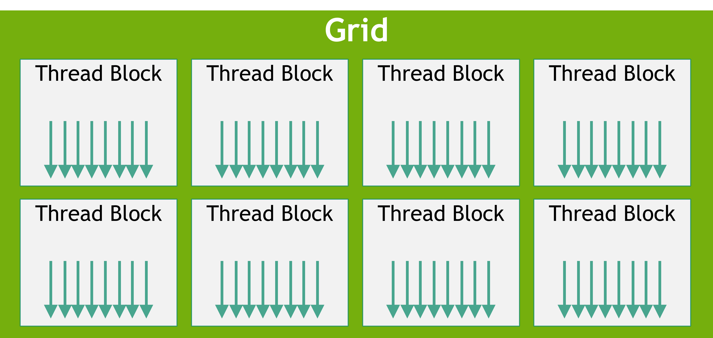

::: questions

- What is a GPU?

:::

::: objectives

- Understand a warp why multiples of 32 (or 64) threads is important
- Understand the hierarchy of GPU memory

:::

## A little history

Grahics Processing Units (GPUs) were originally built to offload 2D and 3D visualisation computation from the CPU onto a dedicated device. The nature of video processing workloads meant that GPUs were built to handle data parallel workloads from the start. As GPUs became increasingly sophisticated, especially with the advent of programmable shaders and floating point support, it became apparent that GPUs offered the potential to perform _general purpose_ computation (GPGPU). By early as 2003 there were already papers demonstrating how GPU graphics primitives could be repurposed to perform linear algebra.

NVIDIA formalised this general purpose computing on its GPUs with its relase of the CUDA library in 2006. Much later in 2016, AMD released ROCm which provided a similar GPGPU interface to its own hardware. There are also open source APIs including OpenCL and Sycl, Microsoft's OneAPI which claims to bridge a range of accelerators, as well as AMD's cross-platform compatility layer known as HIP. Despite these offerings, there remains strong vendor lock-in and NVIDIA and its proprietary CUDA API remains dominant.

Today, GPUs have diverged somewhat in their design depending on whether they are destined to function as a true _graphics_ processing device or as more general purpose compute _accelerator_. Increasingly, AI workloads are driving design decisions that might not be useful for (or even harm!) some scientific workloads.

## The GPU

In most systems, the GPU is phsically distinct from the CPU. It has its own computing cores, its own memory, its own floating point units, its own controllers, and a host of other units. The CPU and the GPU communicate with each other across some kind serialisation link such as PCIe.

In the simplest terms, a GPU is two things:

* Compute, provided by streaming multiprocessors (SM)
* Memory (including DRAM ("global"), SRAM ("shared"), and numerous caches)

### Processing model

* You compute is gridded into thread blocks.
* The GPU scheduler assigns each thread block to an SM when it has capacity
* The SM scheduler assigns a warp to a set of 8 cores when those cores become free
* Cores become free when: a warp has completed; or a warp "stalls", meaning it is waiting for another unit within the SM such as the memory controller, the FPU, or the tensor core
* Each threadblock typically has more threads than there are in one warp: this means it will execute as multiple warps
* Each SM typically has multiple threadblocks assigned to it at one time. Limits include: register space and shared memory space. If a kernel uses a large number of registers or shared memory, this can limit the number of thread blocks assigned at any one time to an SM; in turn this can mean the SM doesn't have threads waiting to mask stalls.

### Streaming multiprocessor

A streaming multiprocessor (SM) is a collection of cores that are grouped together and share some resources in common. Take for example the recent NVIDIA B200 GPU: this has 148 SM, and each SM has 128 cores.

GPU cores (sometimes called a 'CUDA cores', or 'shader processors') are like the cores on your CPU but differ in some important ways:

- They are individually slower. The B200, for example, has clock speeds of only 700 MHz. In highly parallelisable computations, thousands of slow cores tend to be faster than a handful of very fast cores.
- They are much simpler. This simplicity owes in part to the fact that GPUs assume they are always operating in a highly parallel configuration: if a core stalls (e.g. waiting for memory), the GPU assumes there is always another thread waiting to be assigned so that the core won't sit idle. CPUs, on the other hand, are built assuming single-threaded operation, and so use a number of complex techniques to make a serial algorthim (partially) parallelisable at the instruction level (see e.g. [out of order execution](https://en.wikipedia.org/wiki/Out-of-order_execution) or [branch prediction](https://en.wikipedia.org/wiki/Branch_predictor)).
- They are physically smaller, mostly as a result of being slower and simpler.
- They don't have their own register space. Registers are the small "scratch pad" of memory that is immediately accessible by a core. On a CPU, the register is attached to the core, with the downside that if a thread moves between cores it must also move the register memroy. On a GPU, the register space is shared amongst the SM, which makes it easy to suspend and resume threads with no overhead.
- They always run in SIMD/SIMT mode. Threads are grouped together into a batches of 32 (or 64 on AMD hardware) known as a _warp_ and assigned to run in lockstep.

A SM has a number of resources shared amongst the cores. We've already seen that the reigster space is shared. In addition, it has a shared floating point unit (FPU) where, just like on the CPU, when floating point math needs to be performed, the work will be delegated to this shared unit. Unlike on CPUs, these FPUs also have specialised hardware for computing some more complex math functions, like exponents, logarithms and trigonometry. More modern GPUs also have tensor cores which are specialised for matrix operations.

You might ask, why have the streaming mutliprocessor at all? Why have this intermediary entity in the hierarchy between the GPU scheduler and the cores themselves? The answer: physical locality. A GPU is a physical device and distance matters. By grouping the cores and assigning each a set shared resources that reside nearby on the die, we can make their use cheaper and faster.

### Understanding memory

Both a CPU and a GPU have different layers of memory.

You might already know that reading from disk is very slow compared to reading from memory. But "reading from memory" comes in many different flavours too.

For a CPU, the slowest form of memory is reading from system memory. So CPU's have developed all sorts of tricks to "pre-fetch" memory onto caches stored within the CPU itself. These are separated by levels depending on how far away they are to CPU, the so-called  L1, L2, and L3 caches. The CPU does this automatically, and CPU optimisation often involves aligning the CPU's automatic prefetching with an algorithms memory needs.

With a GPU, there is a lot more manual memory management than you might be used to.

In the first instance, you need to transfer memory from the CPU to the GPU's DRAM or "global" memory. Normally, the GPU can't "see" memory that is stored on the host. This is a particularly slow operation and it is important to design algorithms that minimise host to device (or device to host) transfers.

But DRAM is still very slow. The GPU has a number of automatic caches designed to make the DRAM faster. The Level 2 cache is a shared by the whole GPU and the faster L1 cache is shared by each SM.

In addition, each SM has its own "shared" memory. This shared memory can be manually managed by the programmer and should be used where automatic caching is not sufficient.

Finally, there is also the register space.

All three of the registers, the shared memory and the L1 cache compete for space on a single physical piece of SRAM memory.

# Some confusing terms

When you start writing your own kernels, you will need to describe how to parallelise those kernels over your data. This is done by configuring a _grid_ which is itself composed of a configurable number of _threads_. For example, if you are adding two vectors together, you might create as many threads as there are elements of the vectors.

CUDA adds a complication: threads are grouped together into _thread blocks_, and all thread blocks must have the same number of threads.

It can be easy to conflate this software hierarchy (thread  blocks) with the hardware hierarchy (SMs, cores). They are separate.  programming model of grid/thread blocks/threads maps onto the physical hardware in the following way:

* The thread blocks are collected and readied to be worked on
* When a SM has capacity, a new thread block will be allocated to it.
* Multiple thread blocks can be in progress at one time on each SM (cf. latency hiding)
* The actual work done as a wap

You might want to bookmark this section for later once we describe launching your own kernels. It is very easy to confuse the software and hardware hierarchies.
