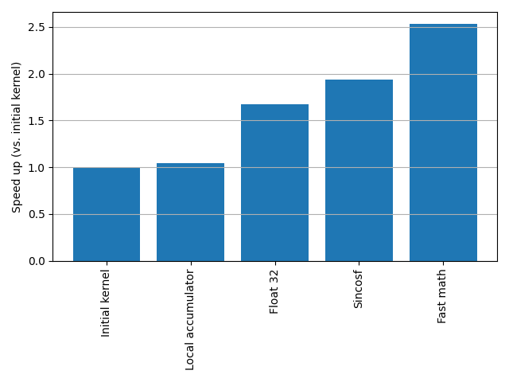
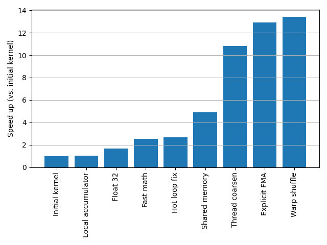

::: questions

- What is a GPU?

:::

::: objectives

- Understand a warp why multiples of 32 (or 64) threads is important
- Understand the hierarchy of GPU memory

:::

## A toy problem

We're going to start with a toy problem: imaging radio interferometry data. In other domains, this is a also known as a non-uniform Fourier transform: we transform from a 3D visibility space to a 2D surface within the imaging space.

An important non-aim: we are not looking to make _algorithmic_ improvements. Real-world imaging software rarely performs a full _direct_ Fourier transform since it is so costly, but those alternative algorithm are more complex and are not our focus here.

The discrete imaging equation is defined as follows:

$$
V(l, m) = \sum V(u, v, w) e^{2 \pi i  (u l + v m + w [n - 1])} \\
\textrm{where} \quad n = \sqrt{1 - l^2 - m^2}
$$

The dimensions $l$ and $m$ span the image domain, whilst the $u, v, w$ coordinates span the (sparse and unevenly sampled) visibility domain. We are prohibited from treating this as a simple 2D fast Fourier transform problem due to two main factors: u, v, w are not even sampled; and the so-called $w$ term is non-neglible.

Image sizes are typically thousands of pixels by thousands of pixels; whilst visibility data is similarly millions of rows in length.

By the end, we hope to be able to image the large radio lobes of Fornax A from the raw visibility data.


## A first implementation

As always, we will approach this first on the CPU where we can ensure we first make things right before attemping a first pass at a kernel.

Let's first set things up. Our data is stored in the file `visibilities.npz` and we will extract each datum and its associated baseline coordinates:

```python
data = np.load("visibilities.npz")
us, vs, ws, vis = data["u"], data["v"], data["w"], data["data"]
```

Next we will set up our imaging grid. We will image a 700 x 700 pixel grid. We will set the scale such that $\Delta l = \Delta m = 10^{-4}$ (this scale is somewhat arbitrary but is chosen to the main radio feature within the image).

```python
lpx, mpx = np.mgrid[-350:350, -350:350]
ls, ms = lpx * 0.0005, mpx * 0.0005
```

Finally, we will precompute the associated values $n' = n - 1 = \sqrt{1 - l^2 - m^2} - 1$:

```python
ndashes = np.sqrt(1 - ls**2 - ms**2) - 1
```

::: challenge

Using numba's `njit` and `prange` functions, attempt to write an CPU-parallel implementation of the direction imaging equation. Ask yourself: what is the unit of parallelisation?

Using matplotlib's `imshow()`, save a figure of the real components of the image.

Note: below we reduce the data by 50x to speed things up. If things take too long for you, try reducing the data even more aggressively.

```python
import matplotlib.pyplot as plt
from numba import njit, prange
import numpy as np

@njit(parallel=True)
def image_numba(us, vs, ws, data, ls, ms, ndashes, img):
    pass
    # TODO

data = np.load("visibilities.npz")
us, vs, ws, data = data["u"], data["v"], data["w"], data["data"]

lpx, mpx = np.mgrid[-350:350, -350:350]
ls, ms = lpx * 0.0005, mpx * 0.0005
ndashes = np.sqrt(1 - ls**2 - ms**2) - 1

# For now, reduce data by 50x since CPU is too slow
us, vs, ws, data = us[::50], vs[::50], ws[::50], data[::50]

img = np.zeros(ls.shape, dtype=complex)
image(us, vs, ws, data, ls, ms, ndashes, img)

plt.imshow(img.real, origin="lower")
plt.savefig("output.png")
```

:::

::: solution

We parallelise over each pixel which, for a 700 x 700 pixel image, gives us just shy of 500,000 threads. And since each pixel is its own independent sum, we don't have to worry about race conditions.

```python
@njit(parallel=True)
def image_numba(us, vs, ws, data, ls, ms, ndashes, img):
    # Parallelise over each output pixel
    for lmpx in prange(ls.size):
        # Convert 1D to 2D pixel index
        lpx, mpx = lmpx // ls.shape[1], lmpx % ls.shape[1]

        # Retrieve l, m and ndash coordinates associated with this pixel
        l, m, ndash = ls[lpx, mpx], ms[lpx, mpx], ndashes[lpx, mpx]

        # Perform the for this one pixel over all of the visibility data
        for u, v, w, datum in zip(us, vs, ws, data):
            phase = 2 * np.pi * (u * l + v * m + w * ndash)
            img[lpx, mpx] += datum * np.exp(1j * phase)
```

Even with only a fifthieth of the data we start to see something resembling the radio lobes:


:::

::: challenge

Now that we have a working CPU version, the next step is to extract the inner loop as a standalone kernel and configure an associated grid to work on the GPU.

Try implementing a simple GPU kernel implementation using the `@numba.cuda` decorator.

**Note:** As with the DFT function we have worked on earlier, you will need to rewrite the imaginary exponential using the identity $e^{i \phi} = \cos{\phi} + i \sin{\phi}$.

:::

::: solution

The implementation is very similar to that used in Numba's prange loop. Some points of note:

* We have chosen here to retain a linear index for simplicity. Additionally, in the case where the image dimensions don't match an even multiple of the threads per block, the 1D grid minimises the amount of threads that "overflow".
* We have rewritten the imaginary exponential as a combination of `cos()` and `sin()`.

```python
@cuda.jit
def kernel(us, vs, ws, data, ls, ms, ndashes, img):
    lmpx = cuda.grid(1)

    if lmpx < img.size:
        lpx, mpx = divmod(lmpx, ls.shape[1])

        # Retrieve l, m and ndash coordinates associated with this pixel
        l, m, ndash = ls[lpx, mpx], ms[lpx, mpx], ndashes[lpx, mpx]

        # Perform sum over all of the visibility data for just one pixel
        for u, v, w, datum in zip(us, vs, ws, data):
            phase = 2 * np.pi * (u * l + v * m + w * ndash)
            img[lpx, mpx] += datum * complex(math.cos(phase), math.sin(phase))
```

We can benchmark this code using the following harness:

```python
# Load the visibility data
data = np.load("visibilities.npz")
us, vs, ws, data = data["u"], data["v"], data["w"], data["data"]

# Initialise the image grid and the corresponding l, m and ndash coordinates
lpx, mpx = np.mgrid[-350:350, -350:350]
ls, ms = lpx * 0.0005, mpx * 0.0005
ndashes = np.sqrt(1 - ls**2 - ms**2) - 1

# Transfer data to the GPU
img_d = cupy.zeros(ls.shape, dtype=complex)
us_d, vs_d, ws_d, data_d, ls_d, ms_d, ndashes_d = map(
    cupy.array, [us, vs, ws, data, ls, ms, ndashes]
)

nthreads = 256
nblocks = math.ceil(img_d.size / nthreads)

result = cupyx.profiler.benchmark(
    lambda: kernel[nblocks, nthreads](
        us_d, vs_d, ws_d, data_d, ls_d, ms_d, ndashes_d, img_d
    ),
    n_repeat=3,
    n_warmup=1,
)
```

:::

On my machine, this first kernel is fast enough to allow us to image the full set of data giving a lovely image of Fornax A:


## Profiling with NSIGHT Compute

Up till now we have used simple timers to measure performance. NVIDIA provides us with an alternative, extremely detailed set of benchmarking tools:

* **NSIGHT Compute:** Provides detailed analysis of a kernel, including its register usage, FMA instruction counts, memory accesses, and so on. This is most useful when optimising a specific kernel.
* **NSIGHT Systems:** A higher-level profiler that can show a timeline of memory transfers, kernel runtimes, streams, and the interleaved dependencies between these different GPU processes. This is most useful to understand the full lifecycle of a program and to help prioritise optimisation work.

In this section, we will focus our work on NSIGHT Compute since we are discussing kernel optimisation. However, in a real-world project always begin with NSIGHT Compute: don't start optimising any specific component until you understand both its contribution to the overall runtime and can estimate the overall effect of its improvement.

NSIGHT Compute is run as a two part process:

1. First, the the kernels of interest are run on the machine wrapped by the `ncu` profiler and save the output data to a file. This can be performed either directly on the command line or via the NSIGHT Compute GUI.
2. You run NSIGHT Compute locally, import the profile file, and use the GUI to explore different metrics of your kernel.

The profiler `ncu` should be included as part of the NVIDIA toolkit installation. However, you will need to NSIGHT Compute locally, which you can [download here.](https://developer.nvidia.com/tools-overview/nsight-compute/get-started)

To run the profiler directly on the command line, enter something like the following:

```
/usr/local/cuda/bin/ncu -o profile -f --kernel-name 'regex:^kernel6' --set detailed -- uv run python timeit-demo.py
```

Here, we output (`-o`) to a file called `profile` (`-f` overwrites if it already exists), we profile the kernel(s) whose names match the regex `^kernel6` (kernel names will always start with the python function nane), and we collect the metrics that are part of the `detailed` set.

Other metric sets are available and can be listed with `ncu --list-sets`. Another helpful set is `roofline`.

The profiling can take some time: it will run our kernel with the full data multiple times, collecting a subset of the metrics each time. The larger the number of metrics you measure, the slower the whole process will take.

Once complete, we load the `profile.mcu-rep` file into the NSIGHT Compute GUI, either by using its remote file functionality or by first transferring the profile data locally.

[ TODO: ]

Things to look for:

* Am I using float64 values by mistake?
* Am I compute bound, memory bound, or neither?
* What is the ratio of FMA to total floating point instructions?

## Optimisation pitfalls

As with making the choice to rewrite an algorithm from a straightforward sequential implementation to a parallel implementation, the choice to optimise comes with some downsides that must be kept in mind.

From the outset you should understand the kind of performance that is necessary to make your original problem computationally tractable and optimise with this concrete goal in mind. _Don't optimise for the sake of optimisation._

As you will see as we progress here, optimisation comes with important downsides:

- It's not always possible! Sometimes the "obvious" optimisations do very little at all, and despite the advertised computational performance of your hardware, these optimisation strategies fail to meaningfully close this gap. This may be because of hardware limits such as memory pressure, intractable aspects of your algorithm, or the unfortunate consequence of the black box that is an optimising compiler. Know when to raise the white flag.
- Optimisation almost invariably results in code bloat. Your code will become substantially longer and substantially more complex.
- Your code will become harder to reason about.
- And as a consequence, you may introduce bugs.

## Optimisation 1: Minimise writing to global memory

We've already touched on this optimisation strategy before, but it's important enough to repeat here: reading and writing to _global_ memory is expensive and currently our kernel currently writes to global memory on every single inner loop.

Memory ordered from fastest to slowest is: local memory, then shared memory, and finally global memory. But by the same token, there is far less local and shared memory storage available; local arrays should typically be sized in the single digits, and shared arrays should typically be sized at most to a few hundred or so entries. (Large reservations of local and shared arrays cause a scaracity of memory and result in fewer simulatenous thread blocks being scheduled in a SM.)

How do you identify which memory is which?

* **Global memory** is any array that is created on the host side (e.g. via `cupy.array(...)`) and passed as an argument to the kernel
* **Shared memory** is memory that is created inside the kernel via `cuda.shared.array(...)`
* **Local memory** are any scalar variables created within the kernel as well as fixed-length arrays created using `cuda.local.array(...)`

::: challenge

Rewrite the kernel to use a local accumulator variable.

1. Initialise a summation variable prior to the loop.
2. On each innerloop iteration, append to this variable (using `+=`).
3. Finally, write the value of this variable to global memory at the culmination of the kernel.

:::

::: solution

```python
@cuda.jit
def kernel(us, vs, ws, data, ls, ms, ndashes, img):
    lmpx = cuda.grid(1)

    if lmpx < img.size:
        lpx, mpx = divmod(lmpx, ls.shape[1])

        # Retrieve l, m and ndash coordinates associated with this pixel
        l, m, ndash = ls[lpx, mpx], ms[lpx, mpx], ndashes[lpx, mpx]

        # Perform sum over all of the visibility data for just one pixel
        pixel = complex(0)
        for u, v, w, datum in zip(us, vs, ws, data):
            phase = 2 * np.pi * (u * l + v * m + w * ndash)
            pixel += datum * complex(math.cos(phase), math.sin(phase))

        img[lpx, mpx] = pixel
```

:::

## Optimisation 2: Floating point precision

You may be aware that floats come in different sizes, which correlate to different precisions. In C, the standard options are `float` and `double`, which correspond to 32 and 64 bit precision. CUDA provides a range of lower precision types such as a 16 bit float (and even some non-standard numerical types that make different trade offs between mantissa and exponent).

Unfortunately, Python hides the types of values and you may not be used to thinking about the precision of your calculations.

On the CPU, floating point performance usually doesn't depend on the precision. That is, the performance ratio of 32 and 64 bit floats is 1:1 (with the important previso that 32 bit floats benefit from their smaller memory footprint). On the GPU, however, the performance ratio can vary enormously, and differs from one GPU to the next. For example, some AMD GPUs have a 1:1 performance ratio which is great for high precision numerical calculations; NVIDIA GPUs, on the other hand, strongly prefer lower precision floats, and this imbalance has increased considerably as their GPUs have been optimised towards AI workloads. A desktop NVIDIA 5080 card, for example, has a performance ratio of 1:64, and their recent datacenter B200 GPU has a performance ratio of 1:2:32 for 64/32/16 bit computations.

**The upshot is: always compute at the minimal precision required.**

To do this for our kernels, there are a few things we need to do:

* **Initialise all arrays by explicitly** passing the optional `dtype` keyword argument and setting to `np.float64`, `np.float32`, `np.float16` (or their complex equivalents, `np.complex128` and `np.complex64`).
* **Cast existing arrays using the `astype()` method** e.g. `arr_f32 = arr_f64.astype(np.float32)`.
* **Initialize (or cast) all intermediate variables or constants with explicit types.** For example:

   * Create an accumator variable with a typed constructor: `acc = np.complex32(0)`
   * Cast Pi to the appropriate precision _before_ use in computation: `np.float32(np.pi)`

* **Use typed mathematical functions** from [`cuda.libdevice`](https://nvidia.github.io/numba-cuda/reference/libdevice.html) to compute at the desired precision (e.g. using `cuda.libdevice.sinf()` rather than `math.sin()`).
* **Understand the rules for type promotion.** Types will be quietly promoted to higher precision when combined with other higher precision types. For example:

   * If you use an integer as part of a calculation with a float, the integer will be first cast to the float type.
   * If you combine floats of mixed precision, the lower precision floats will be first cast to the higher precision.

   As a result, you must be careful of high precision types sneaking in and poisoning your computation to a higher precision than necessary.

::: challenge

For our usecase, we deem 32 bit precision to be acceptable. Modify the input arrays and kernel to use 32 bit floats and 64 bit complex numbers (i.e. 32 bits for each of the real and imaginary components).

Some helpful hints:

* The functions `math.cos()` and `math.sin()` promote inputs to 64 bit floats and output the result as 64 bit floats. To force 32 bit computation, you can use `numba.cuda.libdevice.cosf()` and `numba.cuda.libdevice.sinf()`.
* The functions `np.complex64` and `np.complex128` return an error when passed two arguments inside a kernel. Use `np.complex64(complex(real, imag))` for now. (Open bug report: [https://github.com/NVIDIA/numba-cuda/issues/865](https://github.com/NVIDIA/numba-cuda/issues/865).)

:::

::: solution

```python
@cuda.jit
def kernel(us, vs, ws, data, ls, ms, ndashes, img):
    lmpx = cuda.grid(1)

    if lmpx < img.size:
        lpx, mpx = divmod(lmpx, ls.shape[1])

        # Retrieve l, m and ndash coordinates associated with this pixel
        l, m, ndash = ls[lpx, mpx], ms[lpx, mpx], ndashes[lpx, mpx]

        # Perform sum over all of the visibility data for just one pixel
        pixel = np.complex64(0)
        for u, v, w, datum in zip(us, vs, ws, data):
            phase = 2 * np.float32(np.pi) * (u * l + v * m + w * ndash)
            pixel += datum * complex(
                cuda.libdevice.cosf(phase), cuda.libdevice.sinf(phase)
            )

        img[lpx, mpx] = pixel

# [...]

# Transfer data to the GPU at 32 bit float precision
img_d = cupy.zeros(ls.shape, dtype=np.complex64)
data_d = cupy.array(data, dtype=np.complex64)
us_d, vs_d, ws_d, ls_d, ms_d, ndashes_d = map(
    lambda x: cupy.array(x, dtype=np.float32), [us, vs, ws, ls, ms, ndashes]
)
```

:::

## Optimisation 3: Use specialised mathematical functions

CUDA provides a [wide range of mathematical functions](https://docs.nvidia.com/cuda/cuda-math-api/index.html) at different precisions. These functions are heavily optimised and will use hardware implementations where possible. Numba exposes a subset of these which are documented [here](https://nvidia.github.io/numba-cuda/reference/libdevice.html) and [here](https://nvidia.github.io/numba-cuda/reference/kernel.html#intrinsic-attributes-and-functions).

In fact, we've already made use of these specialised function by using the `sinf` and `cosf` functions.

Depending on your use case, you might use these functions to:

* Control the precision of the function
* Take advantage of specialised functions that might be more efficient for your use case
* Use _fathmath_ functions

`fastmath` functions are worth commenting on slightly further. Fastmath functions take fewer instructions to complete and are therefore faster, but in exchange they trade both precision and correctness. The NVIDIA programming guide, for example, specifies that `fast_sinf()` has an increased error tolerance of $2^{-21.41}$ in the range $-\pi$ to $\pi$, and that this error is larger elsewhere. Fastmath operations also typically break floating point guarantees around associativity and usually assume strictly finite values (NaN and Inf values may be handled incorrectly).

::: challenge

Scan through the list of available mathematical functions that are part of [libdevice](https://nvidia.github.io/numba-cuda/reference/libdevice.html). Rewrite the calls to `sinf` and `cosf` with more efficient operations.

:::

::: solution

There are a number of candidates which stand out as options here:

* `sinpi()` and `cospi()` compute the phase by multiplying it by $\pi$. That's one less multiplication operation that can have a small effect on the speed of our kernel.
* `fast_sin()` and `fast_cos()` are two among a number of similar `fast_` prefixed functions that use their respective fastmath implmentation.

Looking further however, we also spot a family of functions that _co-compute_ both the `sin` and `cos` components of the phase, sharing the result of intermediate computations for both. They are:

* `sincosf()`
* `sincospif()`
* `fast_sincosf()`

After some experimentation, `fast_sincosf()` produces the fastest results and retains the accuracy needed for our use case:

```python
@cuda.jit
def kernel(us, vs, ws, data, ls, ms, ndashes, img):
    lmpx = cuda.grid(1)

    if lmpx < img.size:
        lpx, mpx = divmod(lmpx, ls.shape[1])

        # Retrieve l, m and ndash coordinates associated with this pixel
        l, m, ndash = ls[lpx, mpx], ms[lpx, mpx], ndashes[lpx, mpx]

        # Perform sum over all of the visibility data for just one pixel
        pixel = np.complex64(0)
        for u, v, w, datum in zip(us, vs, ws, data):
            phase = 2 * np.float32(np.pi) * (u * l + v * m + w * ndash)
            sin, cos = cuda.libdevice.fast_sincosf(phase)
            pixel += datum * complex(cos, sin)

        img[lpx, mpx] = pixel
```

:::

## Optimisation 4: Hot loop experimentation

Our kernel's hot loop is located in the innermost for loop. Each kernel runs this code repeatedly, and variations of even a single instruction can have outsized effects on the overall performance of the kernel.

When it comes to eking out performance from your kernel, the hot loops should be a primary focus. Some things to consider:

* **Pre-compute values** as much as possible prior to the innermost loops
* **Minimise the number of operations:** can an equation be reduced by a factor in some way to reduce the number of operations? is there bookkeeping in the loop that can be avoided?
* **Understand the relative costs of operations:** for example, as division is more expensive than multiplication, can the equation be refactored to remove this step (or pre-compute a reciprocal)?

Consider the phase term in our kernel and think about the number of operations performed in each of the following two versions:

```python
# VERSION 1
for u, v, w, datum in zip(us, vs, ws, data):
    phase = 2 * np.float32(np.pi) * (u * l + v * m + w * ndash)
    # [...]

# VERSION 2
l *= 2 * np.float32(np.pi)
m *= 2 * np.float32(np.pi)
ndash *= 2 * np.float32(np.pi)
for u, v, w, datum in zip(us, vs, ws, data):
    phase = (u * l + v * m + w * ndash)
    # [...]
```

Mathematically these are equivalent. In the first we've factored out the $2 \pi$, whilst in the second we've applied this factor to each of the $l, m, n'$ terms prior to entering the loop. On the surface, we've tripled the number of multiplication operations, but we've done so by applying those operations _outside_ the loop. And when the visibility data is large, this upfront cost tends to zero whilst eliding a multiplication operation.

Unfortunately, this kind of optimisation is not always so simple. Remember, our kernel is compiled, and like most modern compilers, the CUDA compiler is an optimising compiler: it will attempt to optimise our code using special huristics. Sometimes the compiler does the right thing, whilst at other times even a slight change in the code might altogether preclude an optimisation from occurring. Even worse, there are multiple layers between our code and what ultimately runs on the GPU: there is the Python to CUDA translation layer; the intermediate PTX language; and the finally compiled SASS kernel. These translation layers are, for the most part, opaque to us and so it is not always clear what the end code looks like nor what optimisations are being performed by the compiler (short of inspecting the PTX assembly instructions).

**This is all to say: optimising the inner loop of the code is a process of experimentation and benchmarking.** Some optimisations, like above, will be obvious. Others, on the other hand, may even introduce performance regressions. Don't be afraid to experiment with different expressions, even when they _should be_ semantically identical.

(In fact, in a later revision of the kernel in this section, I observed the above optimisation to introduce a regression which I cannot explain - yet only for that particular revision! By the next revision the optimisation kicked in again.)

Our revised kernel now looks like this:

```python
@cuda.jit
def kernel(us, vs, ws, data, ls, ms, ndashes, img):
    lmpx = cuda.grid(1)

    if lmpx < img.size:
        lpx, mpx = divmod(lmpx, ls.shape[1])

        # Retrieve l, m and ndash coordinates associated with this pixel
        l = 2 * np.float32(np.pi) * ls[lpx, mpx]
        m = 2 * np.float32(np.pi) * ms[lpx, mpx]
        ndash = 2 * np.float32(np.pi) * ndashes[lpx, mpx]

        # Perform sum over all of the visibility data for just one pixel
        pixel = np.complex64(0)
        for u, v, w, datum in zip(us, vs, ws, data):
            phase = u * l + v * m + w * ndash
            sin, cos = cuda.libdevice.fast_sincosf(phase)
            pixel += datum * complex(cos, sin)

        img[lpx, mpx] = pixel
```

## Intermission

Let's take stock for a momnent. So far, our optimisation steps have been relatively minor. The code is not substantially more complex and is still easy to understand and reason about.

Our relative performance has increased by more than double:



Let me remind you to always optimise with a concreate goal in mind. If this performance improvement is already enough to make your computation tractable, then I would advise stopping and counting that as a win. Otherwise, steel yourself for what comes next!

## Optimisation 5: Minimise reading from global memory

We've previously used a local accumulation variable to minimise _writes_ to global memory. In this section, however, we're going to use shared memory to minimise _reads_ from global memory.

**Our problem is that each kernel needs to read through the entirety of each of the `us`, `vs`, `ws` and `data` arrays.** There's a lot of redundancy here: since each thread is fully independent, they are each reading the same data, from start to end. But what if we could somehow share the burden of these global memory reads amongst the threads?

A standard pattern in kernel design is for each thread in a thread block to cooperate by using shared memory as an intermediate cache. Remember that shared memory is much faster than global memory, and is visible from each thread within a thread block. In doing so, global reads reduce by a factor equal to threads per block. For a thread block with 256 threads, this will reduce global memory reads by a factor of 256.

Suppose there are 256 threads per block. Then the pattern proceeds as follows:

1. The thread block allocates a shared memory array with size 256. Each thread can read and write to this array, and can see the writes of each sibling thread within the thread block.
2. The thread block reads in the first 256 index values of the global memory, with each thread reading a _single, unique_ value based on its thread ID. For example, thread 45 within the thread block reads the 45th value of the global array.
3. Each thread caches its retrieved datum into a unique location in shared memory, using its thread ID as the array index. For example, thread 45 writes to the 45th index of the shared array.
4. Finally, the threads cycle through each value in shared memory and performs its associated computation.

The cycle is then repeated: the _next_ 256 values from global memory are written into shared memory, and so on, until the global memory is exhausted.

In pseduo-code:

```python
# Create shared memory array
xs_shared = cuda.shared.array(256, dtype=np.float32)

tid = cuda.threadIdx.x. # threadId _within_ the thread block
N = len(xs_global)

# Step through the array in blocks of 256
for offset in range(0, N, 256):
    # Write all 256 values from global memory into
    if offset + tid < N:
        # Each thread in the thread block is responsible for reading a unique global memory address
        # and writing to a unique shared memory address based on its thread ID.
        xs_shared[tid] = xs_global[offset + tid]
    else:
        # Unless N is a multiple of 256, you will need to handle the remainder
        xs_shared[tid] = 0

    # Ensure the cache is fully populated before any individual thread tries to read from it
    cuda.syncthreads()

    for x in xs_shared:
        # Compute...
        pass

    # Wait for each thread to finish computation before the cache is repopulated
    cuda.syncthreads()
```

Some important comments:

* We create shared memory by calling `cuda.shared.array(...)` in each thread. But this syntax is deceptive: it _looks_ like each thread creates its own shared array, but this allocation is actually performed just once at the thread block level. Each thread shares the same shared memory array.
* The `cuda.threadIdx.x` is the thread ID _within_ the thread block, ranging in this case from 0 to 255. This is not the global thread ID which we get from `cuda.grid(1)`.
* The thread ID guarantees that each thread reads from, and writes to, a unique address in global and shared memory.
* Since threads within are thread block are not guaranteed to operate in lockstep (only at the warp level is this true), we need to call the synchronisation function `cuda.synchthreads()`. This function acts a gate that stops threads within a given thread block from progressing until all threads have reached this point. This guarantees two things: that the cache is fully populated before we attempt to read from it; and later, that the cache is not updated until all threads have completed reading from it.
* We have to handle the case where `N` is not a multiple of 256. In the example above, on the final batch we pad the shared array with zeros on the assumption that zero is idempotent under our kernel. Other options for handling this remainder exist, such as:

   ```
   for i in range(256, min(N - offset)):
       x = xs_shared[i]
       # Compute...
    ```

::: callout

### Coalesced memory reads

The GPU memory system performs best when a thread block coordinates to read from a _contiguous_ region of memory. In particular, if each thread in a thread block reads the _next_ entry in an array, the GPU can turn all these little reads into a single, unified read instruction. For example, instead of asking the memory system to get me index 0, and then get me index 1, ... and then finally index 1024, the memory system can unify these into a single instruction asking for indices 0-1024. When this happens, it is called _memory coalescing._

On the other hand, if each thread reads from somewhere seemingly random, is non-sequential, or if each thread's memory read is strided (i.e. there are gaps between each read), then the GPU can't combine these into a single, unified read instruction. Those hundreds of reads will be queued and processed one by one. Obviously, this is not good for memory performance.

In the above example, we read from memory using the indexing `offset + tid` which guarantees _memory coalescing_.

:::

::: challenge

Modify the kernel to mimimise global memory reads by caching the global values from `us`, `vs`, `ws`, and `data`.

Start by creating shared memory arrays at the top of the kernel:

```python
NTHREADS = 256
uvw_cache = cuda.shared.array((NTHREADS, 3), dtype=np.float32)
data_cache = cuda.shared.array(NTHREADS, dtype=np.complex64)
```
Then proceed to complete the remaining TODOs.

**Beware:** We must ensure that each thread in a thread block participates in cache generation. For example, the condition `if lmpx < img.size` must no longer result in some threads prematurely terminating. Instead, these "remainder" threads must still continue to play their role in populating and refreshing their associated index in the caches (to be used by the other threads in its thread block) even though they ultimately do not write out to global memory.

```python
```python
@cuda.jit
def kernel(us, vs, ws, data, ls, ms, ndashes, img):
    # TODO:
    # Add the shared memory caches here

    lmpx = cuda.grid(1)

    # TODO:
    # 1. Initialize l, m, ndash
    # 2. Conditionally set l, m, ndash if lmpx < img.size
    # 3. Don't return early!

    # Initialise pixel accumulator variable
    pixel = np.complex64(0)

    # Extract input data in batches of NTHREADS items
    N = data.size
    for offset in range(0, N, NTHREADS):
        # TODO:
        # 1. Fetch data and populate the caches
        # 2. Handle the remainder by setting cache entries to 0.

        # Wait for cache to be populated
        cuda.syncthreads()

        # Iterate over cache
        for j in range(NTHREADS):
            phase = (
                uvw_cache[j, 0] * l +
                uvw_cache[j, 1] * m +
                uvw_cache[j, 2] * ndash
            )
            sin, cos = cuda.libdevice.fast_sincosf(phase)
            pixel += data_cache[j] * complex(cos, sin)

        # Don't start updating cache until all threads are done
        cuda.syncthreads()

    if lmpx < img.size:
        img[lpx, mpx] = pixel
```

:::

::: solution

```python
@cuda.jit
def kernel(us, vs, ws, data, ls, ms, ndashes, img):
    NTHREADS = 256
    uvw_cache = cuda.shared.array((NTHREADS, 3), dtype=np.float32)
    data_cache = cuda.shared.array(NTHREADS, dtype=np.complex64)

    lmpx = cuda.grid(1)

    l, m, ndash = np.float32(0), np.float32(0), np.float32(0)
    if lmpx < img.size:
        lpx, mpx = divmod(lmpx, ls.shape[1])

        # Retrieve l, m and ndash coordinates associated with this pixel
        l = 2 * np.float32(np.pi) * ls[lpx, mpx]
        m = 2 * np.float32(np.pi) * ms[lpx, mpx]
        ndash = 2 * np.float32(np.pi) * ndashes[lpx, mpx]

    # Perform sum over all of the visibility data for just one pixel
    pixel = np.complex64(0)

    # Extract input data in batches of NTHREADS items
    N = data.size
    for offset in range(0, N, NTHREADS):
        # Fetch data and populate cache
        i = offset + cuda.threadIdx.x
        if i < N:
            uvw_cache[cuda.threadIdx.x] = us[i], vs[i], ws[i]
            data_cache[cuda.threadIdx.x] = data[i]
        else:
            uvw_cache[cuda.threadIdx.x] = 0, 0, 0
            data_cache[cuda.threadIdx.x] = 0

        # Wait for cache to be populated
        cuda.syncthreads()

        # Iterate over cache
        for j in range(NTHREADS):
            phase = (
                uvw_cache[j, 0] * l +
                uvw_cache[j, 1] * m +
                uvw_cache[j, 2] * ndash
            )
            sin, cos = cuda.libdevice.fast_sincosf(phase)
            pixel += data_cache[j] * complex(cos, sin)

        # Don't start updating cache until all threads are done
        cuda.syncthreads()

    if lmpx < img.size:
        img[lpx, mpx] = pixel
```

:::

## Optimistion 6: Thread coarsening

Sometimes too much of a good thing can be a bad thing. When it comes to GPU threads, we want enough threads that all SMs have a number of thread blocks queued at any one time. This ensures all CUDA cores are doing work at any one time, and when a thread block needs to pause to wait for something (e.g. to access global memory) there is another thread block reading and waiting to advance its own work.

But only up to a point. Kernels have start up and initialisation costs. And in some kernels, there may be work that is repeated by every kernel that might actually be better if it were shared.

**Thread coarsening** is the process whereby we "dial back" the degree of parallelisation, and instead increase the _computational intensity_ of each kernel.

Consider the following two version of the DFT kernel:

```python
@cuda.jit
def dft(xs, Xs):
    k = cuda.grid(1)
    N = len(xs)

    if k < N:
        xs_k = np.complex64(0)
        for n in range(N):
            phase = -2 * np.float32(np.pi) * k * n / N
            sin, cos = cuda.libdevice.fast_sincosf(phase)
            Xs_k += xs[n] * complex(cos, sin)

        Xs[k] = Xs_k

@cuda.jit
def dft_coarsened(xs, Xs):
    THREAD_COARSEN = 4
    N = len(xs)

    # Allocate local arrays to store:
    # 1. The k index
    # 2. The respective accumulator variable
    ks = cuda.local.array(THREAD_COARSEN, dtype=np.int64)
    Xs_ks = cuda.local.array(THREAD_COARSEN, dtype=np.complex64)

    # Initialise the local arrays
    for i in range(THREAD_COARSEN):
        ks[i] = cuda.grid(1) + i * cuda.gridsize(1)
        Xs_ks[i] = 0  # zero each element of the array

    for n in range(N):
        # Prefetch global memory item
        x = xs[n]
        # Precompute part of the phase term
        partial_phase = -2 * np.float32(np.pi) * n / N

        for i in range(THREAD_COARSEN):
            phase = ks[i] * partial_phase
            sin, cos = cuda.libdevice.fast_sincosf(phase)
            Xs_ks[i] += x * complex(cos, sin)

    for i in range(THREAD_COARSEN):
        k = ks[i]
        if k < N:
            Xs[k] = Xs_ks[i]

```

In the original DFT kernel, each thread is responsible for computing just the `k`'th index of `Xs`. Compare this to the coarsened version, where each thread computes four distinct indices of `Xs`: `k`, `k + gridsize`, ...`k + 3 * gridsize`.

How does it do this?

* We set the thread coarsening factor, `THREAD_COARSEN`, as a constant value within the kernel.
* We create two locally-allocated arrays, one for the k values and one for accumulator variables.
* On each iteration of `n`, we compute for the partial sum of each of the k values.
* By doing so, **we amortise the cost** of accessing `xs[n]` and computing (part of) the phase value across the four indices.

In fact, if you do your own experimentation with this code, you'll see that almost all of the performance win is due to pre-computing the partial phase term.

**Advanced note:** we define `THREAD_COARSEN` as a constant _within_ the kernel. You might be tempted to pass this as an argument so that you can modify the thread coarsening factor dynamically. Unfortunately, the kernel requires that local arrays are sized statically, which means that their size is _known at [compile time.](https://en.wikipedia.org/wiki/Compile_time)_ If it were sized by a function parameter, then this array size would only be known at the time the function is called, that is, at _runtime._ This actually has some flow-on benefits for us: since the compiler knows the size of `THREAD_COARSEN` at compile time, it also knows the size of the loops over `THREAD_COARSEN`, and at its discretion it may choose to [unroll these loops](https://en.wikipedia.org/wiki/Loop_unrolling) for performance gains.

::: challenge

On your machine, experiment with benchmarking different thread coarsening factors for the `dft_coarsened` kernel. What is the ideal factor?

```python
N = 500_000
xs = cupy.random.normal(size=N, dtype=np.float32) + 1j * cupy.random.normal(size=N, dtype=np.float32)
Xs = cupy.zeros_like(xs)

# Set THREAD_COARSEN both here and in the kernel definition. Try values for 1, 2, 3, 4, 6, 8
threads = 128
nblocks = math.ceil(N / threads / THREAD_COARSEN)
print(cupyx.profiler.benchmark(lambda: dft_coarsened[nblocks, threads](xs, Xs), n_repeat=1, n_warmup=1))
```

:::

::: solution

On my own machine, I saw best performance when `THREAD_COARSEN` was set to 4, but it will vary based on the kernel, the GPU, and the problem size. Even larger thread coarsening factors risk a number of problems:

1. The number of thread blocks may descrease to the point where the GPU's SMs are not well utilised.
2. The memory requirements of each thread will obstruct the number of simultaneous thread blocks that can be scheduled on a single SM.
3. Eventually, the memory required for a single thread may become so large that the local register storage "spills" out into global memory. Whe this happens, some of our local variables end up being actually stored in global memory, which is disasterous for performance.

:::

::: challenge

Modify the imaging kernel to use a thread coarsening factor of 3.

Start by creating some local arrays:

```python
THREAD_COARSEN = 3
lmns = cuda.local.array((THREAD_COARSEN, 3), np.float32)
pixels = cuda.local.array(THREAD_COARSEN, np.complex64)
```

And then complete the remainder of the TODOs:

```python
@cuda.jit
def kernel(us, vs, ws, data, ls, ms, ndashes, img):
    NTHREADS = 256
    uvw_cache = cuda.shared.array((NTHREADS, 3), dtype=np.float32)
    data_cache = cuda.shared.array(NTHREADS, dtype=np.complex64)

    # TODO:
    # Allocate the local arrays here

    for i in range(THREAD_COARSEN):
        lmpx = cuda.grid(1) + i * cuda.gridsize(1)
        if lmpx < img.size:
            # TODO:
            # Initialise the values of both of the static arrays

    # Extract input data in batches of NTHREADS items
    N = data.size
    for offset in range(0, N, NTHREADS):
        # Fetch data and populate cache
        i = offset + cuda.threadIdx.x
        if i < N:
            uvw_cache[cuda.threadIdx.x] = us[i], vs[i], ws[i]
            data_cache[cuda.threadIdx.x] = data[i]
        else:
            uvw_cache[cuda.threadIdx.x] = 0, 0, 0
            data_cache[cuda.threadIdx.x] = 0

        # Wait for cache to be populated
        cuda.syncthreads()

        # Iterate over cache
        for j in range(NTHREADS):
            for i in range(THREAD_COARSEN):
                phase = (
                    # TODO:
                    # Compute phase using local arrays
                )
                sin, cos = cuda.libdevice.fast_sincosf(phase)
                pixels[i] += data_cache[j] * complex(cos, sin)

        # Don't start updating cache until all threads are done
        cuda.syncthreads()

    for i in range(THREAD_COARSEN):
        lmpx = cuda.grid(1) + i * cuda.gridsize(1)
        # TODO:
        # Write out each of the accumulated pixel values to global memory
```

:::

::: solution

```python
@cuda.jit
def kernel(us, vs, ws, data, ls, ms, ndashes, img):
    NTHREADS = 256
    uvw_cache = cuda.shared.array((NTHREADS, 3), dtype=np.float32)
    data_cache = cuda.shared.array(NTHREADS, dtype=np.complex64)

    THREAD_COARSEN = 3
    lmns = cuda.local.array((THREAD_COARSEN, 3), np.float32)
    pixels = cuda.local.array(THREAD_COARSEN, np.complex64)

    for i in range(THREAD_COARSEN):
        lmpx = cuda.grid(1) + i * cuda.gridsize(1)
        if lmpx < img.size:
            lpx, mpx = divmod(lmpx, ls.shape[1])

            # Retrieve l, m and ndash coordinates associated with this pixel
            lmns[i, 0] = 2 * np.float32(np.pi) * ls[lpx, mpx]
            lmns[i, 1] = 2 * np.float32(np.pi) * ms[lpx, mpx]
            lmns[i, 2] = 2 * np.float32(np.pi) * ndashes[lpx, mpx]

            # Perform sum over all of the visibility data for just one pixel
            pixels[i] = np.complex64(0)

    # Extract input data in batches of NTHREADS items
    N = data.size
    for offset in range(0, N, NTHREADS):
        # Fetch data and populate cache
        i = offset + cuda.threadIdx.x
        if i < N:
            uvw_cache[cuda.threadIdx.x] = us[i], vs[i], ws[i]
            data_cache[cuda.threadIdx.x] = data[i]
        else:
            uvw_cache[cuda.threadIdx.x] = 0, 0, 0
            data_cache[cuda.threadIdx.x] = 0

        # Wait for cache to be populated
        cuda.syncthreads()

        # Iterate over cache
        for j in range(NTHREADS):
            for i in range(THREAD_COARSEN):
                phase = (
                    uvw_cache[j, 0] * lmns[i, 0] +
                    uvw_cache[j, 1] * lmns[i, 1] +
                    uvw_cache[j, 2] * lmns[i, 2]
                )
                sin, cos = cuda.libdevice.fast_sincosf(phase)
                pixels[i] += data_cache[j] * complex(cos, sin)

        # Don't start updating cache until all threads are done
        cuda.syncthreads()

    for i in range(THREAD_COARSEN):
        lmpx = cuda.grid(1) + i * cuda.gridsize(1)
        if lmpx < img.size:
            lpx, mpx = divmod(lmpx, ls.shape[1])
            img[lpx, mpx] = pixels[i]
```

**An aside:** You might think that it might be more efficient to prefetch the $u, v, w$ terms _prior_ to the loop over the thread coarsening factor. That is, something like this:

```python
# Iterate over cache
for j in range(NTHREADS):
    u, v, w = uvw_cache[j]
    for i in range(THREAD_COARSEN):
        phase = (
            u * lmns[i, 0] +
            v * lmns[i, 1] +
            w * lmns[i, 2]
        )
        sin, cos = cuda.libdevice.fast_sincosf(phase)
        pixels[i] += data_cache[j] * complex(cos, sin)
```

This hot loop optimisation avoids unneccessary accesses to shared memory by instead placing those values into registers which are faster. However, at least for my environment, this version turned out to be actually slower (and I don't know why!). In both version, the compiler _should_ recognise that these are in fact the same pattern and that it should compile to whichever method is faster, but this is clearly a case where the compiler fails us. As always, benchmark ruthlessly.

:::

## Optimisation 7: Force FMA instructions

Fused multiply add (FMA) instructions are a special hardware instruction that combines both a muliplication and addition as a single operation. In pseudo-code:

```python
cuda.fma(a, b, c) = a * b + c
```

If we can rewrite a pair multiplication and addition operations as a single FMA operation, we can straightforwardly double our performance. (In fact, the numbers for GPU floating point performance that you'll see NVIDIA or AMD advertising _assume_ that 100% of your code is pure FMA instructions – which almost no non-trivial kernel is possible of achieving.)

The CUDA compiler _should_ make an effort to automatically attempt to insert FMA instructions into your code, but it has been my experience that it is less than perfect.

Let's consider the expression from our inner loop:

```python
pixels[i] += data_cache[j] * complex(cos, sin)
```

How would we write this as an FMA instruction? The first and most immediate problem we encounter here is that `cuda.fma` is defined strictly for `np.float32` and `np.float64` types, whereas here we are dealing with complex numbers. Let's expand this a little into real and imaginary components:

```python
pixels[i] += complex(
    datum.real * cos - datum.imag * sin,  # real component
    datum.real * sin + datum.imag * cos   # imaginary component
)
```

If we consider just the real component for a moment, then we can write this as two FMA instructions:

```python
pixels_real[i] = cuda.fma(datum.real, cos, pixels_real[i])
pixels_real[i] = cuda.fma(datum.imag, -sin, pixels_real[i])
```

Check that this makes sense to you!

::: challenge

We are going to rewrite `pixels[i] += data_cache[j] * complex(cos, sin)` as a sequence of 4 FMA instructions.

There's a small problem here. Whilst we can retrieve the real and imaginary components of a complex number with the `.real` and `.imag` attributes respectively, we aren't able to mofify these values. To simplify the presentation here, we will create the accumlation array `pixel` as 2D array, with the second dimension corrsponding to the real and imaginary components:

```python
pixels = cuda.local.array((THREAD_COARSEN, 2), np.float32)
```

(You will need to update the code that zeroes this array too.)

Once you have done this, attept to write out the inplace complex addition as a sequence of 4 FMA instructions. As a hint, the first looks like this:

```python
pixels[i, 0] = cuda.fma(datum.real, cos, pixels[i, 0])
```

:::

::: solution

Finally, we arrive at a kernel that looks like that shown below.

```python
@cuda.jit
def kernel(us, vs, ws, data, ls, ms, ndashes, img):
    NTHREADS = 256
    uvw_cache = cuda.shared.array((NTHREADS, 3), dtype=np.float32)
    data_cache = cuda.shared.array(NTHREADS, dtype=np.complex64)

    THREAD_COARSEN = 3
    lmns = cuda.local.array((THREAD_COARSEN, 3), np.float32)
    pixels = cuda.local.array((THREAD_COARSEN, 2), np.float32)

    for i in range(THREAD_COARSEN):
        lmpx = cuda.grid(1) + i * cuda.gridsize(1)
        if lmpx < img.size:
            lpx, mpx = divmod(lmpx, ls.shape[1])

            # Retrieve l, m and ndash coordinates associated with this pixel
            lmns[i, 0] = 2 * np.float32(np.pi) * ls[lpx, mpx]
            lmns[i, 1] = 2 * np.float32(np.pi) * ms[lpx, mpx]
            lmns[i, 2] = 2 * np.float32(np.pi) * ndashes[lpx, mpx]

            # Perform sum over all of the visibility data for just one pixel
            pixels[i] = 0, 0

    # Extract input data in batches of NTHREADS items
    N = data.size
    for offset in range(0, N, NTHREADS):
        # Fetch data and populate cache
        i = offset + cuda.threadIdx.x
        if i < N:
            uvw_cache[cuda.threadIdx.x] = us[i], vs[i], ws[i]
            data_cache[cuda.threadIdx.x] = data[i]
        else:
            uvw_cache[cuda.threadIdx.x] = 0, 0, 0
            data_cache[cuda.threadIdx.x] = 0

        # Wait for cache to be populated
        cuda.syncthreads()

        # Iterate over cache
        for j in range(NTHREADS):
            for i in range(THREAD_COARSEN):
                phase = cuda.fma(
                    uvw_cache[j, 0],
                    lmns[i, 0],
                    cuda.fma(uvw_cache[j, 1], lmns[i, 1], uvw_cache[j, 2] * lmns[i, 2]),
                )
                sin, cos = cuda.libdevice.fast_sincosf(phase)
                pixels[i, 0] = cuda.fma(data_cache[j].real, cos, pixels[i, 0])
                pixels[i, 0] = cuda.fma(data_cache[j].imag, -sin, pixels[i, 0])
                pixels[i, 1] = cuda.fma(data_cache[j].real, sin, pixels[i, 1])
                pixels[i, 1] = cuda.fma(data_cache[j].imag, cos, pixels[i, 1])

        # Don't start updating cache until all threads are done
        cuda.syncthreads()

    for i in range(THREAD_COARSEN):
        lmpx = cuda.grid(1) + i * cuda.gridsize(1)
        if lmpx < img.size:
            lpx, mpx = divmod(lmpx, ls.shape[1])
            img[lpx, mpx] = complex(pixels[i, 0], pixels[i, 1])
```

You might wonder: did the compiler fail to use FMA instructions because we were using complex numbers? After all, complex numbers 'wrap' a 2-tuple of floats and this indirection might obscure the underlying operations. Try experimenting with this: if we retain the real and imaginary parts stored seperately as we have below, and write out the real and imaginary components separately using normal multiplication and addition operators, do you see the same speedup?

:::

## Optimisation 8: Warp shuffling (optional)

I hesitated to include this final section as it in fact doesn't substantially improve the speed of our code, nor is it idiomatic. In fact, I would advise that the previous version of the kernel is the right place to stop and uses the most recognisable patterns.

However, I do want you to be aware of a few more intrinsics that might come in handy for your particular use case. Namely, there is a set of warp level intrinsics that let you move data _directly between registers_ amongst members of a warp (being the set of 32 threads that execute in lockstep). Normally, these intrinsics might be used as part of a reduction operation, or they might be used to broadcast a single value to the other members of the warp. Warp communication should usually be slightly faster than communicating values via shared memory.

We're going to use these intrinsics to replace our shared memory cache. Instead of using shared memory, each warp member will load a unique (and successive) value of each of $u, v, w$ and $data$. But then we will have each thread "pass the parcel" 32 times using `cuda.shfl_sync()`, effectively daisychaining the input data amongst the warp, before they continue by reading in the next chunk of input data.

`cuda.shfl_sync()` accepts 3 parameters:

- The first is a mask which indicates which of the warp threads are to participate in the swap. Since we want every thread to play its part, we set this to `0xFFFFFF`.
- The second parameter is the source ID. Ranging from 0 to 31, this identifies the warp whose value we want to receive.
- The payload value. This is the value that we offer up to the shuffle, and if another warp member set us as the origin, this is the value that they will receive.

We can use `cuda.shfl_sync()` to act as a warp-wide cache as demonstrated by the following pseudo code:

```python
warpid = cuda.threadIdx.x % cuda.warpsize
nextwarpid = (cuda.threadIdx.x + 1) % cuda.warpsize

N = len(xs)
for i in range(0, N, cuda.warpsize):
    x = xs[i + warpid]
    for _ in range(cuda.warpsize):
        # Do some computation with x

        # Then daisy chain x amongst the warp
        x = cuda.shfl_sync(0xFFFFFF, nextwarpid, x)
```

There's no need to use synchronisation calls because the warp executes in lockstep (however, be careful to avoid divergence at any place where `shfl_sync` is called).

::: challenge

Remove the shared memory cache from our kernel and instead implement a warp-wide cache that follows the pattern set out above.

Note that `cuda.shfl_sync()` is limited only to floats, doubles. For complex values we'll have to transmit the real and imaginary parts separately, e.g.: `x = complex(cuda.shfl(0xFFFFFF, nextwarpid, x.real), cuda.shfl(0xFFFFFF, nextwarpid, x.imag))`.

:::

::: solution

Shared memory is the idiomatic way to cache data and avoid global memory operations: it is what you will see in most CUDA tutorials, and is most appropriate when the cache is large. For the sake of exposing you to warp level intrinsics, however, this code demonstrates how `cuda.shfl_sync` can act as a substitute cache that has equal performance.

Note that the threadsize for this kernel can be set to any arbitrary multiple of 32. In my own benchmarking, using 512 threads had the best performance.

```python
@cuda.jit
def kernel(us, vs, ws, data, ls, ms, ndashes, img):
    THREAD_COARSEN = 3
    lmns = cuda.local.array((THREAD_COARSEN, 3), np.float32)
    pixels = cuda.local.array((THREAD_COARSEN, 2), np.float32)

    for i in range(THREAD_COARSEN):
        lmpx = cuda.grid(1) + i * cuda.gridsize(1)
        if lmpx < img.size:
            lpx, mpx = divmod(lmpx, ls.shape[1])

            # Retrieve l, m and ndash coordinates associated with this pixel
            lmns[i, 0] = 2 * np.float32(np.pi) * ls[lpx, mpx]
            lmns[i, 1] = 2 * np.float32(np.pi) * ms[lpx, mpx]
            lmns[i, 2] = 2 * np.float32(np.pi) * ndashes[lpx, mpx]

            # Perform sum over all of the visibility data for just one pixel
            pixels[i, 0] = 0
            pixels[i, 1] = 0

    WARPSIZE = cuda.warpsize
    warpid = cuda.threadIdx.x % WARPSIZE
    nextwarpid = (cuda.threadIdx.x + 1) % WARPSIZE

    # Extract input data in batches of WARPSIZE items
    N = data.size
    for offset in range(0, N, WARPSIZE):
        # Each warp member loads its respective visibility data
        i = offset + warpid
        if i < N:
            u, v, w = us[i], vs[i], ws[i]
            datum = data[i]
        else:
            u, v, w, = np.float32(0), np.float32(0), np.float32(0)
            datum = np.complex64(0)

        # Iterate over warp cache
        for _ in range(WARPSIZE):
            for i in range(THREAD_COARSEN):
                phase = cuda.fma(
                    u,
                    lmns[i, 0],
                    cuda.fma(v, lmns[i, 1], w * lmns[i, 2]),
                )
                sin, cos = cuda.libdevice.fast_sincosf(phase)
                pixels[i, 0] = cuda.fma(datum.real, cos, pixels[i, 0])
                pixels[i, 0] = cuda.fma(datum.imag, -sin, pixels[i, 0])
                pixels[i, 1] = cuda.fma(datum.real, sin, pixels[i, 1])
                pixels[i, 1] = cuda.fma(datum.imag, cos, pixels[i, 1])

            # Daisychain the values around members of the warp
            u = cuda.shfl_sync(0xffffff, u, nextwarpid)
            v = cuda.shfl_sync(0xffffff, v, nextwarpid)
            w = cuda.shfl_sync(0xffffff, w, nextwarpid)

            datum = complex(
                cuda.shfl_sync(0xffffff, datum.real, nextwarpid),
                cuda.shfl_sync(0xffffff, datum.imag, nextwarpid)
            )

    for i in range(THREAD_COARSEN):
        lmpx = cuda.grid(1) + i * cuda.gridsize(1)
        if lmpx < img.size:
            lpx, mpx = divmod(lmpx, ls.shape[1])
            img[lpx, mpx] = complex(pixels[i, 0], pixels[i, 1])
```

:::

## Final comparison

We have made substantial performance gains, at just over 13 times the performance of the initial kernel:


