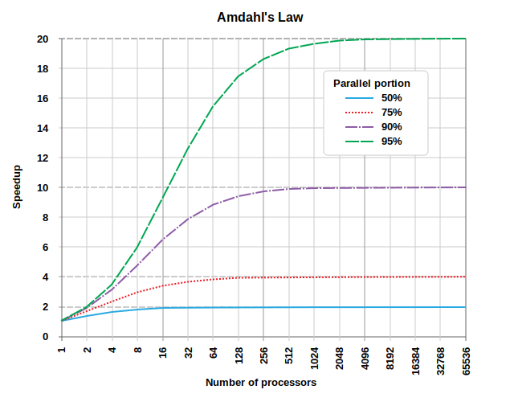

::: questions

- What is the difference between task and data parallelism?
- How does Amdahl's Law constrain the maximum speedup from parallelism?
- What is a data race and how do you avoid one?

:::

::: objectives

- Identify "embarrassingly parallel" problems.
- Define and identify a data race.
- Use Numba's `@njit` and `prange` to parallelise Python loops on the CPU.

:::

## Why go parallel?

The short answer is speed.

You've probably heard of [Moore's Law](https://en.wikipedia.org/wiki/Moore%27s_law), the observation that the number of transistors in a CPU doubles every two years. Up until the early 2000s, this law held true for the single-core CPUs of the time. Processor speeds increased from being measured in mere kHz, to MHz and finally to GHz. But physical limitations, and in particular power draw and heat, put a stop to those increases. CPU cores today have clock speeds measured in the same single digit GHz range as they did 25 years ago (with only marginal gains coming from [instruction efficiencies](https://en.wikipedia.org/wiki/Instructions_per_cycle)).

Moore's Law has continued unabated, but those extra transistors have spilled over into multicore CPUs and GPUs. Serial programs that execute one instruction at a time gain nothing from this shift. Increasing performance must come instead through parallelism: doing more work simultaneously, rather than doing each piece of work faster.

GPUs take this to an extreme. GPU parallelism trades _latency_ for _throughput_: any single GPU core is considerably slower than a modern CPU core, but a GPU can run tens of thousands of tasks simultaneously. If your problem can be decomposed into many independent units of work, a GPU can process all of them in far less total time than a serial CPU could manage.

### Amdahl's Law

[Amdahl's Law](https://en.wikipedia.org/wiki/Amdahl%27s_law) formalises what is a very obvious observation. Consider an example where 80% of your computation is parallelisable. Then no matter how many threads you throw at a problem, that remaining 20% represents a hard floor. With only 4 cores, the actual speedup is closer to 2.86x — significantly less than the 4x you might naively expect.

More formally, the speed up, $S$, is given by:

$$S = \frac{1}{(1 - p) + \frac{p}{N}}$$

where $p$ is the fraction of the program that can be parallelised, and $N$ is the number of parallel execution units (cores, threads, etc.).



Credit: Daniels220 at English Wikipedia

**The practical takeaway:** parallelism delivers the most benefit when the parallelisable portion of your code is both large and dominates the runtime. If your bottleneck is I/O or your algorithm is principally serial in nature, throwing more cores at it will do little.

::: challenge

Think about your own code: which parts are parallelisable and which are fundamentally serial? Can you provide an estimate of the kinds of speedup you could expect?

:::

## Task parallelism versus data parallelism

Parallel code comes in two principal forms.

### Task parallelism

Task parallelism divides work into different types of jobs. Each task functions autonomously and relies on communication between tasks to coordinate.

**Example:** Consider building a bike: one person assembles frames, another builds tyres, and a third puts it all together. This series of specialised tasks is one form of task parallelism known as _pipelining_. Another is a _worker pool_: each person builds a complete bike from scratch, but (possibly) to a different customer specification.

Task parallelism requires careful coordination — semaphores, mutexes, locks, message passing, and other synchronisation primitives. This coordination is a common source of bugs.

Task parallelism is the principal model of threaded operations on the CPU (e.g., Python's `threading` or `multiprocessing` modules, or C's OpenMP tasks).

### Data parallelism

Data parallelism applies the _same_ computation to many independent pieces of data. Each thread performs identical work on variable inputs.

**Example:** Applying a filter to every pixel in an image. The filter is the same; the pixel data differs.

Data parallelism is implemented in hardware on the CPU as "single instruction, multiple data" (SIMD) — for example, AVX or SSE instructions that operate on vectors of data within a single CPU register. On the GPU it is implemented as "single instruction, multiple thread" (SIMT) — the same concept scaled to tens of thousands of threads.

This programming model is quite restrictive:

- The computation must be identical for each data element.
- Communication between threads is very limited; each thread should proceed independently.
- Threads ideally proceed in lockstep — branches that cause threads to diverge can be costly.

GPUs are built around data parallelism and derive much of their speed advantage from the restrictive model and the simplicity it affords to both the hardware and software implementations.

**Throughout this workshop we focus exclusively on data parallelism.** The GPU is a data parallel machine, and the kernels you will write are data parallel kernels.

## An introduction to Numba

To experiment with data parallelism on the CPU before moving to the GPU, we are going to use [Numba](https://numba.pydata.org/). Numba is a just-in-time (JIT) compiler that translates annotated Python code into fast, machine-level code.

JIT compilation means that the translation happens at _runtime_: the first time a decorated function is called, Numba compiles it based on the argument types. Subsequent calls reuse the compiled version, so the compilation overhead is paid only once. The same JIT mechanism is used later when we write GPU kernels — the kernel is compiled to CUDA code on first call and cached thereafter.

Numba will be fundamental to our later workflows for writing GPU kernels: we first write the kernel on the CPU, verify that it works when run in parallel in Numba, and finally shift the code onto the GPU.

::: callout

The JIT compiler used in Numba (and later in CUDA) compiles code at the function boundary. When the function is first called, the compiler will first inspect the types of each of the function's arguments (e.g. `int`, `float`, or perhaps `np.array(dtype=complex)`). Based on these input types, the types of the whole function are then _inferred_ and finally the function is compiled to machine code. This compilation takes a little time (a few hundred ms or so), but only needs to be done once. Next time the function is called, and the types match, the cached function will be used.

You might also sometimes see `@njit` code with type annotations in the decorator. Whilst these have no effect on performance they may be useful as documentation or in ensuring argument types match expectations.

:::

### The `@njit` decorator

The simplest way to use Numba is the `@njit` decorator, which compiles a function into optimised machine code:

```python
from numba import njit
import numpy as np

@njit
def add(xs, ys, zs):
    for i in range(len(xs)):
        zs[i] = xs[i] + ys[i]

N = 1_000_000
xs = np.random.normal(size=N)
ys = np.random.normal(size=N)
zs = np.empty(N)

add(xs, ys, zs)
np.testing.assert_allclose(zs, xs + ys)
```

The function looks like ordinary Python, but after JIT compilation it runs at near-C speed. Numba supports a substantial (but limited) subset of Python: loops, conditionals, numpy array access, and many math functions. It does not support most Python object-oriented features or dynamic typing.

Note that we allocated the memory (`xs`, `ys`, and `zs`) _outside_ the function. Just as we will see later with CUDA kernels, it is best to pre-allocate Numba arrays in regular Python and pass them in as arguments, with one of those arguments typically used to write the function output.

### Parallel loops with `prange`

Numba's `prange` (parallel range) is the easiest way to write data parallel code. It tells Numba to distribute each of the loop iterations across CPU threads:

```python
from numba import njit, prange
import numpy as np

@njit(parallel=True)
def add(xs, ys, zs):
    for i in prange(len(xs)):
        zs[i] = xs[i] + ys[i]

N = 1_000_000
xs = np.random.normal(size=N)
ys = np.random.normal(size=N)
zs = np.empty(N)

add(xs, ys, zs)
np.testing.assert_allclose(zs, xs + ys)
```

Two things changed here:

* We use `prange` for the loop instead of the regular `range`
* We set `parallel=True` in the decorator

Each iteration of the loop is independent — thread `i` reads from and writes to index `i`, and no other thread touches that index. This is the hallmark of a good data parallel problem: the work is decomposed into independent units that can proceed in any order.

Keep in mind that while `prange` looks like `range` the iterations are not guaranteed to execute in order, nor are they guaranteed to execute all at once. Numba decides how to distribute the work across available CPU threads.

::: challenge

Write a `prange`-parallel function that computes the element-wise square root of an array. Verify correctness against `numpy.sqrt`.

```python
@njit(parallel=True)
def parallel_sqrt(xs, ys):
    # TODO: use prange to fill ys with the square root of each element of xs
    pass

xs = np.random.uniform(0, 10, size=1_000_000)
ys = np.empty_like(xs)
parallel_sqrt(xs, ys)
np.testing.assert_allclose(ys, np.sqrt(xs))
```

:::

::: solution

```python
@njit(parallel=True)
def parallel_sqrt(xs, ys):
    for i in prange(len(xs)):
        ys[i] = np.sqrt(xs[i])
```

:::

## The pitfalls of parallelism

Parallel code promises increased performance but it comes with some real costs too. For example:

- **Not everything parallelises.** Some parts of your algorithm may inherently depend on results from earlier steps. These inherently serial aspects of your code place strict limits on the effects of parallelisation (see Amdahl's law).
- **Parallel code is harder to reason about.** Parallel code is usually more complex to write. It is also harder to understand: with multiple threads executing at once, the order of operations is no longer guaranteed.
- **More complexity means more bugs.** Parallelism introduces an entirely new class of errors — data races — that appear when threads compete for shared resources.
- **Parallel code introduces its own costs.** There is an overhead cost to managing and scheduling multiple threads; and there can arise resource bottlenecks for memory or I/O.

Something that we will stress repeatedly throughout this course is that you must carefully weigh these costs against any possible performance gains. Be selective in what is parallelised, and always consider performance improvements in terms of the lifecycle of the entire program (and that includes development time too!).

### Data races

The most insidious class of bugs in parallel code is the _data race_. A data race occurs when two or more threads access the same memory location concurrently, and at least one of them is writing — with no synchronisation between them.

Consider this attempt at a parallel sum:

```python
@njit(parallel=True)
def racy_sum(xs):
    # We initialise x_sum as a single element array to stop Numba from fixing our
    # race condition. If we used a scalar value, e.g. by initialising x_sum = 0;
    # then Numba will secretly fix our race condition.
    x_sum = np.zeros(1)
    for i in prange(len(xs)):
        x_sum[0] += xs[i]
    return x_sum[0]

xs = np.ones(1_000_000)
print("Sum:", racy_sum(xs))
# Expected: 1000000.0
# Actual:   ? (likely wrong, and varies each run!)
```

The problem is that `x_sum[0] += xs[i]` is not a single operation — it is three:

1. **Read** the current value of `x_sum[0]`.
2. **Add** `xs[i]` to it.
3. **Write** the result back to `x_sum[0]`.

With multiple threads executing these steps simultaneously, threads can read a stale value before another thread has written its update. The result is lost, and the final sum is incorrect — and nondeterministic, varying from run to run.

Race conditions occur in any situation where multiple threads access shared and mutable state of some kind.

::: challenge

Run the `racy_sum` function several times. Does it always return the same result? Does the result change if you increase the size of the input array?

:::

One approach to resolving this problem is to give each thread its own accumulator:

```python
from numba import njit, prange, get_num_threads, get_thread_id

@njit(parallel=True)
def safe_sum(xs):
    # Each thread gets its own slot
    x_sums = np.zeros(get_num_threads())
    for i in prange(len(xs)):
        x_sums[get_thread_id()] += xs[i]

    # Serial reduction of per-thread sums
    return x_sums.sum()

xs = np.ones(1_000_000)
print("Sum:", safe_sum(xs))  # 1000000.0 — correct and deterministic
```

Each thread writes only to its own index, so there is no contention. The final serial reduction is cheap because there is one entry per CPU thread (typically fewer than 64).

### Performance overhead

Parallel code doesn't come for free. In fact, sometimes throwing _more_ threads at a problem can make things slower.

The types of overhead differ between CPU and GPU. When using CPU-backed threads, some of the costs include:

- **Thread spawning**: which involves creating a thread and allocating it some initial memory
- **Context switching:** when there are more threads than cores, the host OS will periodically suspend threads to "fairly" let each thread advance its work
- **Communication overhead:** all higher level communication methods are built on a toolbox of atomics, locks, semaphores and condition variables and these have a non-negligible overhead

On the GPU, the costs are different — owing mostly to the fact that the CPU (the "host") and the GPU (the "device") are physically distinct. Some of these costs include:

- **Memory transfers:** GPUs have their own memory that is separate from the host and it takes time to transfer back and forth
- **Command latency:** telling the GPU what to do and transferring kernels has some associated latency
- **Synchronisation and communication:** a GPU has its own synchronisation primitives and a limited ability to communicate, both of which have a cost

When designing GPU code you must ensure that the computational benefits dwarf the associated costs of memory transfers and ensure your algorithm uses synchronisation sparingly.

In addition, your algorithm may also be slowed down by **resource contention.** This occurs when different threads all attempt to access a single resource of some kind, perhaps a file on disk, a network resource, or even to access memory. Slow downs due to resource contention can sometimes be non-linear (known as performance cliffs).

### Code complexity

Serial code is very easy to reason about: first this happens, then this, and finally that. Under the hood, the compiler may perform [all sorts of optimisations](https://en.wikipedia.org/wiki/Optimizing_compiler) (e.g. rearranging the order of instructions or pre-emptively executing a conditional branch) but it does this whilst guaranteeing that these are invisible within the thread.

Parallel code tends to be much more complex:

- Each thread is doing only part of the overall computation
- You can no longer guarantee the ordering of operations: threads may start, suspend, and stop at different times
- Compiler optimisations become visible between threads
- Significant programmer work is required to reason about and handle synchronisation

These complexities mean that bugs are more likely, and you must weigh this against the performance benefits you expect.

**Always write your algorithm in a single threaded, serial form first, and use this to test your parallel code later for correctness.**

::: challenge

Consider the following simple Python loops. Which of these is safe to parallelise with `prange`, and if not, why not.

``` python
# A
for i in range(len(xs) - 1):
    ys[i] = xs[i] ** 2 + xs[i + 1]**2

# B
for i in range(1, len(xs)-1):
    ys[i] = (xs[i-1] + xs[i+1]) / 2   # read from xs, write to ys

# C
for i in range(len(xs)):
    if xs[i] > threshold:
        indices.append(i)

# D
x_min = xs[0]
for i in range(len(xs)):
    if xs[i] < x_min:
        x_min = xs[i]

# E
for i in range(len(xs)):
    if xs[i] > 0:
        ys[i] = math.sqrt(xs[i])
```

:::

::: solution

* A is safe: threads read from the same values, but since these are not changed this is not a race condition.
* B is safe: reads and writes to different arrays.
* C is not safe: appending to an array mutates shared state.
* D is not safe: there is a race condition on the shared and mutable `x_min` value.
* E is safe: conditional is per-thread, no shared state.

:::